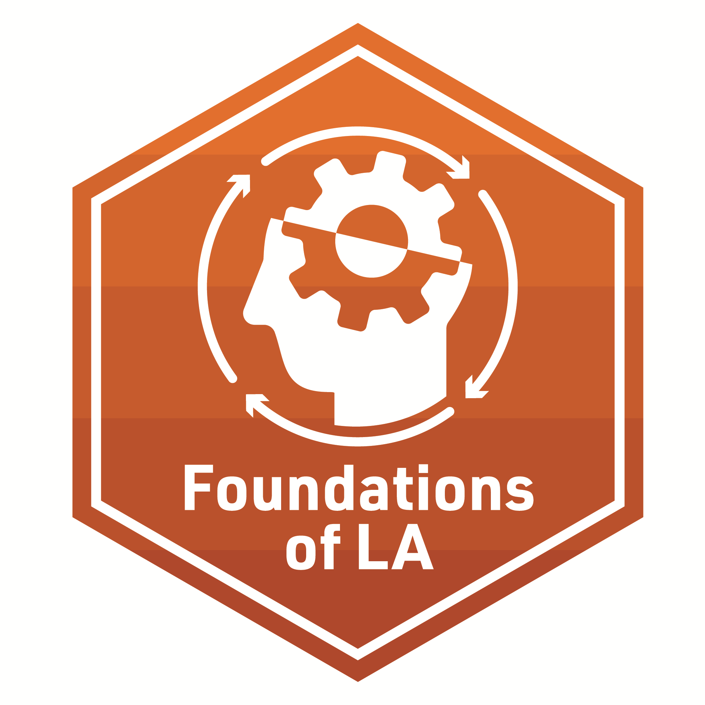

## Foundation of Learning Analytics for STEM Education Research

 Foundation knowledge is the base knowledge of which new knowledge is built. Learning Analytics is the measurement, collection, analysis and reporting of data about learners and their contexts, for purposes of understanding and optimizing learning and the environments in which it occurs (Siemens, 2011).

 These foundation labs allow for the gentle introduction of conceptual understanding of foundation of learning analytics along with R programming basics for STEM Education Research. 

## **Foundation lab 1** - Data types and Characteristics

**Required Pre-Reading:**

[Learning Analytics Goes to School, (Ch. 2, pp. 15 - 28) By Andrew Krumm, Barbara Means, Marie Bienkowski](https://laser-institute.github.io/LASER_Foundations_2023/lab1/Readings/Learning%20Analytics%20Goes%20to%20School.pdf)

[Educational data mining and learning analytics: An updated survey. By Romero, C., & Ventura, S.](https://laser-institute.github.io/LASER_Foundations_2023/lab1/Readings/Educational_data_mining_and_learning_analytics.pdf)

**[Foundation Presentation - One](https://laser-institute.github.io/LASER_Foundations_2023/lab1/found-lab-1-slides.html#1) and code-along:**
This presentation is a review of the types of data typically used to perform learning analytics in education. The focus of the essential readings are to introduce LASER Scholars to the most common data structures used in Learning Analytics. We will look closely at Digital Learning Environments, Administrative Data and Sensors / Multimodal. 

The code-along includes introduction of commonly used packages that read in different data types. Scholars learn to use the readr package from tidyverse to organize data into data frames and tibbles. Additionally, scholars will learn how to read in files using the Haven package.  

Case Study work includes:
- Prepare
  + How to read in Packages
    + Tidyverse Package

**Required Work:**

- Make sure to complete the R Programming primers:  [Work with Data](https://rstudio.cloud/learn/primers/2))

**Badge Requirement**

- Complete the Badge requirement document[Foundations badge - Data Sources](https://laser-institute.github.io/LASER_Foundations_2023/lab1/found-lab-1-badge.html).

## **Foundation lab 2** - Methods

**Required Pre-Reading:**

1. [Learning Analytics Goes to School, (WRANGLE, Ch. 2, pp 28 - 41) By Andrew Krumm, Barbara Means, Marie Bienkowski](https://laser-institute.github.io/LASER_Foundations_2023//lab2/Readings/Learning%20Analytics%20Goes%20to%20School.pdf)
2. [The journey of learning analytics. By Joksimović, Kovanović & Dawson](https://laser-institute.github.io/LASER_Foundations_2023/lab2/Readings/The_Journey_of_Learning_Analytics.pdf)
3.  [OPTIONAL: R for Data Science, (Ch. 3) by Hadley Wickham & Garrett Grolemund](https://r4ds.had.co.nz/transform.html)

**[Foundation Presentation - Two](https://laser-institute.github.io/LASER_Foundations_2023/lab2/found-lab-2-slides.html#1) and code-along:**
Learning Analytics. The focus of the essential reading dives deep into the Methods commonly found in Learning Analytics.

LEARNING ANALYTICS WORKFLOW

- Predictive Analysis
- Social Network Analytics
- Discourse Analysis
- Text Analysis
- Multimodal Analysis

The accompanying code-along introduces R Markdown and Markdown syntax, as well as the YAML header. Participants will practice preparing and wrangling data, including reading in and tidying data. 

Case Study work includes:
- Wrangle
  + Read in Data
  + Import
  + Tidy
  + Join

**Required Work:**

-  Make sure to complete the R Programming primers:  [Tidy your Data](https://rstudio.cloud/learn/primers/4)

**Badge Requirement**

-  Complete the badge requirement document from your lab 2 folder [foudationlab2_badge - Data Sources](https://laser-institute.github.io/LASER_Foundations_2023/lab2/found-lab-2-badge.html).

## **Foundation-lab 3** - Power of Data Viz

**Required Pre-Reading:**

1.[Learning Analytics Goes to School, (Explore, Ch. 3, pp. 43 - 49) By Andrew Krumm, Barbara Means, Marie Bienkowski](https://laser-institute.github.io/LASER_Foundations_2023/lab3/Readings/Learning Analytics Goes to School.pdf)
2.[R for Data Science, (Ch. 3 & 7) by Hadley Wickham & Garrett Grolemund](https://r4ds.had.co.nz/index.html)
3.[SKIM: Data Visualization: A practical Introduction (Ch. 1 & 3) by Kieren Healy](https://socviz.co/)

**[Foundations Presentation - Three](https://laser-institute.github.io/LASER_Foundations_2023/lab3/found-lab-3-slides.html#1) and code-along:**
The overview introduces and reviews some of the basic principles of data visualization as it relates to data graphics, including data visualization perception and color.

DATA VISUALIZATION in LA

- Benefits of Data Visualization
- Types of Data Visualization 
- Real-world Examples of Data Viz 
- Best Practices

The accompanying code-along takes a deep dive into the ggplot2 grammar in a simple-to-understand layering approach. We will look at a representation of numeric variables using some of the most popular geoms, histogram and scatter plot, and put it all together to answer a research question. At the end of this code-along participants will understand the "hows" of ggplots aesthetics. 

Case Study work includes:
- EXPLORE
  + `ggplot2` grammar
  + Scatter plot
  + Histogram

**Required Work:**

-  Make sure to complete the R Programming primer: [Introduction to data visualization](https://rstudio.cloud/learn/primers/3))

**Badge Requirement**

-  Complete the badge requirement document from your lab 3 folder [foundationlab3_badge- Data Visualization](https://laser-institute.github.io/LASER_Foundations_2023/lab3/found-lab-3-badge.html).

## **Foundation-lab 4** - Data Products

**Required Pre-Reading:**

1. [Learning Analytics Goes to School, (Model/Communicate Ch. 3, pp. 49 - 59) By Andrew Krumm, Barbara Means, Marie Bienkowski](https://laser-institute.github.io/LASER_Foundations_2023/lab4/Readings/Learning%20Analytics%20Goes%20to%20School.pdf)
2. [R for Data Science, (Ch. 28 & 29) by Hadley Wickham & Garrett Grolemund](https://r4ds.had.co.nz/graphics-for-communication.html)
3. [OPTIONAL: Communicating data to an audience. By Drucker, Huron, Kosara, Schwabish & Diakopoulos](https://laser-institute.github.io/LASER_Foundations_2023/lab4/Readings/Communicating%20Data%20to%20an%20Audience%20-%20preprint%20copy.pdf)

**[Foundation Presentation - Four](https://laser-institute.github.io/LASER_Foundations_2023/lab4/found-lab-4-slides.html#1) and code-along:**

This presentation will cover the essentials of crafting a data product for different stakeholders. 

- Data storytelling
- narrative elements, 
- methods for improving stakeholder understanding and facilitating resolution or call-to-action. 

The code-along will focus on using R Markdown to create reports in a variety of formats and will introduce formatting for bibliographies and in-text citations for scholarly publications.

Case Study work includes:
- Model
  + Correlation Matrix
    + APA Formatted Table
  + Linear Regression
    + APA Formatted Table
  + Summarize 

- Communicate
  + Select
  + Polish
  + Narrate
  

**Required Work:**

-  Make sure to complete the R Programming primer: [R Markdown](https://rmarkdown.rstudio.com/lesson-1.html?_ga=2.149737333.2122961316.1655817816-1599820931.1654624890)

**Badge Requirement**

-  Complete the badge requirement document from your lab 4 folder [foudationlab4_badge - Data Products](https://laser-institute.github.io/LASER_Foundations_2023/lab4/found-lab-4-badge.html).

THANK YOU!! 
