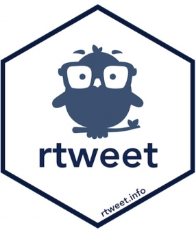
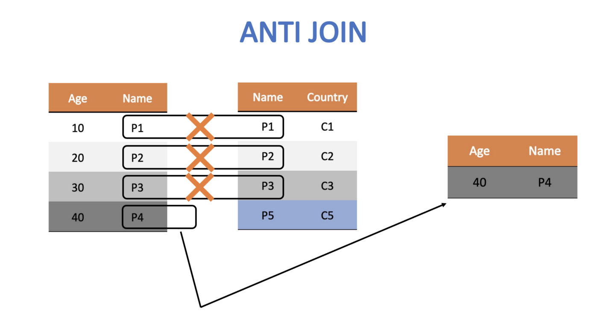

```{r setup, include=FALSE}
knitr::opts_chunk$set(echo = TRUE)
```

## 1. PREPARE

Data sources such as digital learning environments and administrative data systems, as well as data produced by social media websites and the mass digitization of academic and practitioner publications, hold enormous potential to address a range of pressing problems in education, but collecting and analyzing text-based data also presents unique challenges. This week, our case study is guided by my colleague Josh Rosenberg's study, *Advancing new methods for understanding public sentiment about educational reforms: The case of Twitter and the Next Generation Science Standards***.**

We will focus on conducting a very simplistic "replication study" by comparing the sentiment of tweets about the [Next Generation Science Standards](https://www.nextgenscience.org) (NGSS) and [Common Core State Standards](http://www.corestandards.org) (CCSS) in order to better understand public reaction to these two curriculum reform efforts. Specifically, our Unit 3 case study will cover the following topics:

1.  **Prepare**: We'll take a quick look at Dr. Rosenberg's study, load packages we'll need for analysis, and learn how to use Twitter's API to retrieve data for those that created a Twitter Developer account.
2.  **Wrangle**: We focus on basic text mining processes such as text tokenization and stop word removal. Specifically, we will learn how to "tidy text" so we can perform some basic analyses such as retrieving word counts and term frequencies.
3.  **Explore**: In order to see what insight our data provides into answering our research questions, we will calculate some basic simple summary statistics from our tidied text and use data visualization to highlight some of these insights.
4.  **Model:** We learn about sentiment lexicons in our third lab and introduce the {vader} package to model the sentiment of tweets about the NGSS and CCSS state standards in order to better understand public reaction to these two curriculum reform efforts.
5.  **Communicate:** To wrap up our case study, we'll write a brief summary of our findings and a short reflection on what we learned.

### 1a. Review the Literature

The **Unit 3 Case Study: Public Sentiment and the State Standards** is guided by a recent publication by [@rosenberg2021] *Understanding Public Sentiment About Educational Reforms: The Next Generation Science Standards on Twitter*. This study in turn builds on upon previous work by @wang2017 examining public opinion on the Common Core State Standards (CCSS) on Twitter. For Module 1, we will focus on analyzing tweets about the [Next Generation Science Standards](https://www.nextgenscience.org) (NGSS) and [Common Core State Standards](http://www.corestandards.org) (CCSS) in order to better understand key words and phrases that emerge, as well as public sentiment towards these two curriculum reform efforts.

[{width="50%"}](https://doi.org/10.1177/23328584211024261)

[Full Paper (AERA Open)](https://journals.sagepub.com/doi/full/10.1177/23328584211024261)

#### Abstract

System-wide educational reforms are difficult to implement in the United States, but despite the difficulties, reforms can be successful, particularly when they are associated with broad public support. This study reports on the nature of the public sentiment expressed about a nationwide science education reform effort, the Next Generation Science Standards (NGSS). Through the use of data science techniques to measure the sentiment of posts on Twitter about the NGSS (*N* = 565,283), we found that public sentiment about the NGSS is positive, with only 11 negative posts for every 100 positive posts. In contrast to findings from past research and public opinion polling on the Common Core State Standards, sentiment about the NGSS has become more positive over time---and was especially positive for teachers. We discuss what this positive sentiment may indicate about the success of the NGSS in light of opposition to the Common Core State Standards.

#### Data Sources

Similar to data we'll be using for this case study, Rosenberg et al. used publicly accessible data from Twitter collected using the Full-Archive Twitter API and the {rtweet} package in R. Specifically, the authors accessed tweets and user information from the hashtag-based #NGSSchat online community, all tweets that included any of the following phrases, with "/" indicating an additional phrase featuring the respective plural form: "ngss", "next generation science standard/s", "next gen science standard/s".

Data used in this case study was pulled using an [Academic Research developer account](https://developer.twitter.com/en/products/twitter-api/academic-research) and the {academictwitter} package, which uses the Twitter API v2 endpoints and allows researchers to access the full twitter archive, unlike the standard developer account. Data includes all tweets from January through May of 2020 and included the following terms: `#ccss`, `common core`, `#ngsschat`, `ngss`.

Below is an example of the code used to retrieve data for this lab. **This code is set not to execute and will NOT run** without your developer credentials installed, but it does illustrate the search query used, variables selected, and time frame. For those that created a standard developer account, we will learn later in this section how to retrieve data from Twitter using the {rtweet} package.

```{r, eval=FALSE}
library(academictwitteR)
library(tidyverse)

ccss_tweets_2021 <-
  get_all_tweets('(#commoncore OR "common core") -is:retweet lang:en',
                 "2021-01-01T00:00:00Z",
                 "2021-05-31T00:00:00Z",
                 bearer_token,
                 data_path = "ccss-data/",
                 bind_tweets = FALSE)

ccss_tweets <- bind_tweet_jsons(data_path = "ccss-data/") |>
  select(text,
         created_at,
         author_id,
         id,
         conversation_id,
         source,
         possibly_sensitive,
         in_reply_to_user_id)


write_csv(ccss_tweets, "data/ccss-tweets.csv")
```

#### Analysis

The authors determined Tweet sentiment using the Java version of SentiStrength to assign tweets to two 5-point scales of sentiment, one for positivity and one for negativity, because SentiStrength is a validated measure for sentiment in short informal texts (Thelwall et al., 2011). In addition, they used this tool because Wang and Fikis (2019) used it to explore the sentiment of CCSS-related posts.

We'll be using the AFINN sentiment lexicon which also assigns words in a tweet to two 5-point scales, in addition to exploring some other sentiment lexicons to see if they produce similar results. We will use a similar approach to label tweets as positive, negative, or neutral using the {Vader} package which greatly simplifies this process.

The authors also used the `lme4` package in R to run a mixed effects model to determine if sentiment changes over time and differs between teachers and non-teachers. We won't try to replicate in this study, but we will take a look at some of their findings from this model in below.

#### **Summary of Key Findings**

1.  Contrasting with sentiment about CSSS, sentiment about the NGSS science education reform effort is overwhelmingly positive, with approximately 9 positive tweets for every negative tweet.
2.  Teachers were more positive than non-teachers, and sentiment became substantially more positive over the ten years of NGSS-related posts.
3.  Differences between the context of the tweets were small, but those that did not include the #NGSSchat hashtag became more positive over time than those posts that did not include the hashtag.
4.  Individuals posted more tweets during #NGSSchat chats, the sentiment of their posts was more positive, suggesting that while the context of individual tweets has a small effect (with posts not including the hashtag becoming more positive over time), the effect upon individuals of being involved in the #NGSSchat was positive.

Finally, you can watch Dr. Rosenberg provide a quick 3-minute overview of this work at <https://stanford.app.box.com/s/i5ixkj2b8dyy8q5j9o5ww4nafznb497x>

### 1b. Define Questions

One overarching question that Silge and Robinson (2018) identify as a central question to text mining and natural language processing, and that we'll explore later in this case study, is the question:

> How do we to **quantify** what a document or collection of documents is about?

The questions guiding the Rosenberg et al. study attempt to quantify public sentiment around the NGSS and how that sentiment changes over time. Specifically, they asked:

1.  What is the public sentiment expressed toward the NGSS?
2.  How does sentiment for teachers differ from non-teachers?
3.  How do tweets posted to #NGSSchat differ from those without the hashtag?
4.  How does participation in #NGSSchat relate to the public sentiment individuals express?
5.  How does public sentiment vary over time?

For our text mining case study, we'll use approaches similar to those used by the authors cited above to better understand public discourse surrounding these standards, particularly as they relate to STEM education. We will also try to guage public sentiment around the NGSS, by comparing how much more positive or negative NGSS tweets are relative to CSSS tweets. Specifically, in this case study we'll attempt to answer the following questions:

1.  What are the most frequent words or phrases used in reference to tweets about the CCSS and NGSS?
2.  How does sentiment for NGSS compare to sentiment for CCSS?

### 1c. Load Libraries

#### tidytext 📦

{width="20%"}

As we'll learn first hand in this module, using tidy data principles can also make many text mining tasks easier, more effective, and consistent with tools already in wide use. The {tidytext} package helps to convert text into data frames of individual words, making it easy to to manipulate, summarize, and visualize text using using familiar functions form the {tidyverse} collection of packages.

Let's go ahead and load the {tidytext} package:

```{r}
library(tidytext)
```

For a more comprehensive introduction to the `tidytext` package, I cannot recommend enough the free and excellent online book, *Text Mining with R: A Tidy Approach* [@silge2017text]. If you're interested in pursuing text analysis using R after this course, this will be a go to reference.

#### The vader Package 📦

{width="20%"}\

The {vader} package is for the Valence Aware Dictionary for sEntiment Reasoning (VADER), a rule-based model for general sentiment analysis of social media text and specifically attuned to measuring sentiment in microblog-like contexts.

To learn more about the {vader} package and its development, take a look at the article by Hutto and Gilbert (2014), [VADER: A Parsimonious Rule-based Model forSentiment Analysis of Social Media Text](http://comp.social.gatech.edu/papers/icwsm14.vader.hutto.pdf).

Let's go ahead and load the VADER library:

```{r}
library(vader)
```

**Note:** The {vader} package can take quite some time to run on a large datasets like the one we'll be working with, so in our Model section we will examine just a small(ish) subset of tweets.

#### **rtweet 📦 (Optional)**

{width="20%"}

The {rtweet} package provides users a range of functions designed to extract data from Twitter's REST and streaming APIs and has three main goals:

1.  Formulate and send requests to Twitter's REST and stream APIs.

2.  Retrieve and iterate over returned data.

3.  Wrangling data into tidy structures.

For those that haves Twitter account or created a Twitter Developer account, load the {rtweet} package that we'll be using to accomplish all three of the goals listed above:

```{r}
library(rtweet)
```

#### Other Packages

Finally, there are a few other packages we'll need to get started. The first two should look familiar while third {wordcloud2} package is handy little package for creating interactive word clouds.

```{r}
library(tidyverse)
library(wordcloud2)
```

## 2. WRANGLE

The importance of data wrangling, particularly when working with text, is difficult to overstate. Just as a refresher, wrangling involves the initial steps of going from raw data to a dataset that can be explored and modeled [@krumm2018]. This case study will place a heavy emphasis on preparing text for analysis and in particular we'll learn how to:

a.  **Import Tweets**. First we revisit the familiar `read_csv()` function for reading in our CCSS and NGSS tweets into R. For those of you who created a Twitter Developer Account, we'll also demonstrate the use of the {rtweet} package for downloading data directly from Twitter.
b.  **Restructure Data**. We focus on removing extraneous data using the `select()` and `filter()` functions from {dplyr}, and revisit functions from the [Tidy Your Data Primer](https://rstudio.cloud/learn/primers/4.3) for merging data frames.
c.  **Tidy Text.** Finally, we introduce the {tidytext} package to "tidy" and tokenize our tweets in order to create our data frame for analysis. We also introduce a new join function to remove "stop words" that don't add much value to our analysis.

### 2a. Import Tweets from API (Optional)

This section is optional and only for those who have either a Twitter account or have [setup a Twitter Developer Account and App](https://laser-institute.github.io/laser-sundry/twitter-setup.html#Introduction). This section walks you through authentication of your Twitter account and introduces the following functions from the {rtweet} package for reading Twitter data into R:

-   [`search_tweets()`](https://www.rdocumentation.org/packages/rtweet/versions/0.7.0/topics/search_tweets) Pulls up to 18,000 tweets from the last 6-9 days matching provided search terms. 
-   [`search_tweets2()`](https://www.rdocumentation.org/packages/rtweet/versions/0.7.0/topics/search_tweets) Returns data from **multiple** search queries. 
-   [`get_timelines()`](https://www.rdocumentation.org/packages/rtweet/versions/0.7.0/topics/search_tweets) Returns up to 3,200 tweets of one or more specified Twitter users.

#### Authentication

**User (Twitter Account Required)**

By default the {rtweet} package uses a common app for all the users that only requires you to log into Twitter and authorize the rtweet app to use your account to request data from Twitter. Although default authentication doesn't require you to have a developer account, using the default authentication might cause problems while using rtweet since you are sharing the same resource with many people!

If you just want to test out the {rtweet} package and you don't want to set up a developer account and app, however, you can use `auth_setup_default()` function. It will call `rtweet_user()` to use your current logged account on your default browser as the authentication used by `rtweet` and save it as "default" for the session (See [Saving and loading](https://cran.r-project.org/web/packages/rtweet/vignettes/auth.html#save)).

```{r, eval=FALSE}
auth_setup_default()
```

If you use rtweet for more than a day or want to learn how to use the package, it is recommended that you apply for your own developer account and set up your own authentication.

**Apps (Developer Account Required)**

If you have twitter developer account and you have [set up a twitter app](https://laser-institute.github.io/laser-sundry/twitter-setup.html#Create_a_Twitter_App), you still have to tell {rtweet} about it.

To use app based authentication, run the following code to run the `rtweet_app()` function, then enter the *bearer token* that you saved earlier when prompted, and assign your authentication to an object named `auth`:

```{r, eval=FALSE}
auth <- rtweet_app()
```

**Note:** It's good practice to only provide keys and tokens interactively as we've done here, because that makes it harder to accidentally share them in either your `.Rhistory` or an `.R` file.

**Check Authentication**

Now you have an `auth` object that you can provide to the `token` argument of any rtweet function:

```{r, eval=FALSE}
test_tweets <- search_tweets("#ngss", token = auth)

test_tweets
```

It's a good idea to do this once to check that you've entered all the app data correctly, but it'd be annoying if you had to pass this object around every single time. Instead, you can call `auth_as()` to set this as the default for the remainder of the session:

```{r, eval=FALSE}
auth_as(auth)
```

**Saving and loading**

`auth_as()` only lasts for a single session; if you close and re-open R, you'd need to repeat the whole process (generate the tokens and pass them to `rtweet_user()`, `rtweet_app()` or `rtweet_bot()`). This would be annoying (!) so rtweet also provides a way to save and reload authentications across sessions:

```{r, eval=FALSE}
auth_save(auth, "some-name")
```

The second argument to `auth_save()` can be any string. It just needs to be meaningful to you so that you remember exactly what you're loading when you use it a future session:

```{r, eval=FALSE}
auth_as("some-name")
```

Run the following code to launch the authorization vignette to learn more about Twitter API authorization using the {retweet} package:

```{r, eval=FALSE}
vignette("auth", package="rtweet")
```

#### Search Tweets

Since one of our goals for this case study is a very crude replication of the study by Rosenberg et al. (2021), let's begin by introducing the `search_tweets()` function and try reading into R 5,000 tweets containing the "NGSSchat" hashtag and store as a new data frame `ngss_all_tweets`.

Type or copy the following code into your R script or console and run:

```{r, eval=FALSE}
ngss_all_tweets <- search_tweets(q = "#NGSSchat", n=5000)
```

Note that the first argument `q =` that the `search_tweets()` function expects is the search term included in quotation marks and that `n =` specifies the maximum number of tweets

#### [Your Turn]{style="color: green;"} ⤵

View your new `ngss_all_tweets`data frame using the code chunk below and answer the following questions:

```{r, eval=FALSE}
ngss_all_tweets
```

1.  How many tweets did our query using the Twitter API actually return? How many variables?

    -   

2.  Why do you think our query pulled in far less than 5,000 tweets requested?

    -   

3.  Does our query also include retweets? How do you know?

    -   

#### **Remove Retweets**

While not explicitly mentioned in the paper, it's likely the authors removed retweets in their query since a retweet is simply someone else reposting someone else's tweet and would duplicate the exact same content of the original.

Let's use the `include_rts =` argument to remove any retweets by setting it to `FALSE`:

```{r, eval=FALSE}
ngss_non_retweets <- search_tweets("#NGSSchat", 
                                   n=5000, 
                                   include_rts = FALSE)

ngss_non_retweets
```

#### **Using the OR Operator**

If you recall from the [Data Sources] section above, the authors accessed tweets and user information from the hashtag-based #NGSSchat online community, all tweets that included any of the following phrases, with "/" indicating an additional phrase featuring the respective plural form: "ngss", "next generation science standard/s", "next gen science standard/s".

Let's modify our query using the `OR` operator to also include "ngss" so it will return tweets containing either #NGSSchat or "ngss" and assign to `ngss_or_tweets`:

```{r, eval=FALSE}
ngss_or_tweets <- search_tweets(q = "#NGSSchat OR ngss", 
                                n=5000, 
                                include_rts = FALSE)
```

#### [Your Turn]{style="color: green;"} ⤵

Try including both search terms but excluding the `OR` operator to answer the following question:

```{r, eval=FALSE}
ngss_both_tweets <- search_tweets(q = "#NGSSchat ngss", 
                                n=5000, 
                                include_rts = FALSE)
```

1.  Does excluding the `OR` operator return more tweets, the same number of tweets, or fewer tweets? Why?

    -   

2.  What other useful arguments does the `search_tweet()` function contain? Try adding one and see what happens.

    -   

**Hint:** Use the `?search_tweets` help function to learn more about the `q` argument and other arguments for composing search queries.

#### Use Multiple Queries

Unfortunately, the `OR` operator will only get us so far. In order to include the additional search terms, we will need to use the `c()` function to combine our search terms into a single list.

The `rtweets` package has an additional `search_tweets2()` function for using multiple queries in a search. To do this, either wrap single quotes around a search query using double quotes, e.g., `q = '"next gen science standard"'` or escape each internal double quote with a single backslash, e.g., `q = "\"next gen science standard\""`.

Copy and past the following code to store the results of our query in `ngss_tweets`:

```{r, eval=FALSE}
ngss_tweets <- search_tweets2(c("#NGSSchat OR ngss", 
                                '"next generation science standard"', 
                                '"next generation science standards"', 
                                '"next gen science standard"', 
                                '"next gen science standards"' ), 
                              n=5000, 
                              include_rts = FALSE)
```

#### Our First Dictionary

Recall that for our research question we wanted to compare public sentiment about both the NGSS and CCSS state standards. Let's go ahead and create our very first "dictionary" for identifying tweets related to either set of standards, and then use that dictionary for our the `q =` query argument to pull tweets related to the state standards.

To do so, we'll need to add some additional search terms to our list:

```{r, eval=FALSE}
ngss_dictionary <- c("#NGSSchat OR ngss", 
                     '"next generation science standard"', 
                     '"next generation science standards"', 
                     '"next gen science standard"', 
                     '"next gen science standards"') 

ngss_tweets <- search_tweets2(ngss_dictionary, n=5000, include_rts = FALSE)
```

Now let's create a dictionary for the Common Core State Standards and pass that to our `search_tweets()` function to get the most recent tweets:

```{r, eval=FALSE}
ccss_dictionary <- c("#commoncore", '"common core"') 
ccss_tweets <- 
  ccss_dictionary |> 
  search_tweets2(n=5000, include_rts = FALSE)
```

Notice that you can use the pipe operator with the `search_tweets()` function just like you would other functions from the tidyverse.

#### [Your Turn]{style="color: green;"} ⤵

1.  Use the `search_tweets` function to create you own custom query for a twitter hashtag or topic(s) of interest.

```{r, eval=FALSE}

#YOUR CODE HERE
```

#### Other Useful Queries

For your independent analysis, you may be interest in exploring posts by specific users rather than topics, key words, or hashtags. Yes, there is a function for that too!

For example, let's create another list containing the usernames of me and some of my colleagues at the Friday Institute using the `c()` function again and use the `get_timeline()` function to get the most recent tweets from each of those users:

```{r, eval=FALSE}
fi <- c("sbkellogg", "TooSweetGeek", "haspires", "tarheel93", "drcallie_tweets", "AlexDreier") 

fi_tweets <- fi |> get_timeline(include_rts=FALSE)
```

And let's use the `sample_n()` function from the `dplyr` package to pick 10 random tweets and use `select()` to select and view just the `screenname` and `text` columns that contains the user and the content of their post:

```{r, eval=FALSE}
sample_n(fi_tweets, 10) |> select(id, text)
```

We've only scratched the surface of the number of functions available in the `rtweets` package for searching Twitter. Use the following function to learn more about the {retweet} package:

```{r, eval=FALSE}
vignette("rtweet", package="rtweet")
```

#### [Your Turn]{style="color: green;"} ⤵

To conclude Section 2a, try one of the following search functions from the `rtweet` vignette:

1.  `get_timelines()` Get the most recent 3,200 tweets from users.
2.  `stream_tweets()` Randomly sample (approximately 1%) from the live stream of all tweets.
3.  `get_friends()` Retrieve a list of all the accounts a user follows.
4.  `get_followers()` Retrieve a list of the accounts following a user.
5.  `get_favorites()` Get the most recently favorited statuses by a user.
6.  `get_trends()` Discover what's currently trending in a city.
7.  `search_users()` Search for 1,000 users with the specific hashtag in their profile bios.

```{r}

```

### 2b. Import Tweets from CSV

As noted above, data used in this case study was pulled using an [Academic Research developer account](https://developer.twitter.com/en/products/twitter-api/academic-research) and the {academictwitter} package, which uses the Twitter API v2 endpoints and allows researchers to access the full twitter archive, unlike the {rtweet} package, which limits the number of tweets and the length of time from which you can pull tweets.

Data for this case study includes all tweets from January through May of 2020 and includes the following terms: `#ccss`, `common core`, `#ngsschat`, `ngss`. Since we'll be working with some computational intensive functions later in this case study that can take some time to run, I restricted the time frame for my search to only a handful of month. Even so, we'll be working with over 30,000 tweets and nearly 1,000,000 words for our analysis!

Let's use the by now familiar `read_csv()` function to import our `ccss_tweets.csv` file saved in our data folder:

```{r}
ccss_tweets <- read_csv("data/ccss-tweets.csv", 
          col_types = cols(author_id = col_character(), 
                           id = col_character(),
                           conversation_id = col_character(), 
                           in_reply_to_user_id = col_character()
                           )
          )

ccss_tweets
```

Note the addition of the `col_types =` argument for changing some of the column types to character strings because the numbers for those particular columns actually indicate identifiers for authors and tweets:

-   `author_id` = the author of the tweet

-   `id` = the unique id for each tweet

-   `converastion_id` = the unique id for each [conversation thread](https://developer.twitter.com/en/docs/twitter-api/conversation-id)

-   `in_reply_to_user_id` = the author of the tweet being replied to

#### [Your Turn]{style="color: green;"} ⤵

Use the following code chunk to import the NGSS tweets located in the same data folder as our common core tweets. By default, R will treat numerical IDs in our dataset as numeric values but we will need to convert these to characters like demonstrated above for the purpose of analysis:

```{r}
ngss_tweets <- read_csv("data/ngss-tweets.csv", 
          col_types = cols(author_id = col_character(), 
                           id = col_character(),
                           conversation_id = col_character(), 
                           in_reply_to_user_id = col_character()
                           )
          )

ngss_tweets
```

Importing data and dealing with data types can be a bit tricky, especially for beginners. Recall from previous case studies that RStudio has an "Import Dataset" feature in the Environment Pane that can help you use the {readr} package and associated functions to greatly facilitate this process. If you get stuck, you can copy the code generated in the lower right hand corner of the Import Dataset window.

{width="80%"}

Now use the following code chunk to inspect the `head()` of each data frame and answer the questions that follow:

```{r}
head(ngss_tweets)
head(ccss_tweets)
```

Wow, so much for a family friendly case study! Based on this very limited sample, which set of standards do you think Twitter users are more negative about?

-   CSSS

Let's take a slightly larger sample of the CCSS tweets:

```{r}
ccss_tweets |> 
  sample_n(20) |>
  relocate(text)
           
```

#### [Your Turn]{style="color: green;"} ⤵

Use the code chunk below to take a sample of the NGSS tweets. Try to do it without looking at the code above first:

```{r}
ngss_tweets |> 
  sample_n(20) |>
  relocate(text)
```

1.  Still of the same opinion?

    -   

2.  What else you notice about our data sets? Record a few observations that you think are relevant to our analysis or might be useful for future analyses.

    -   

3.  What questions do you have about these data sets? What are you still curious about?

    -   

### 2c. Restructure Data

#### Subset Tweets

As you may have noticed, we have more data than we need for our analysis and should probably pare it down to just what we'll use.

Let's start with the CCSS tweets first. And since this is a family friendly case study, let's use the `filter()` function introduced in previous labs to filter out rows containing "possibly sensitive" language:

```{r, eval=TRUE}
ccss_tweets_1 <- ccss_tweets |> 
  filter(possibly_sensitive == "FALSE")
```

Now let's use the `select()` function to select the following columns from our new `ss_tweets_clean` data frame:

1.  `text` containing the tweet which is our primary data source of interest
2.  `author_id` of the user who created the tweet
3.  `created_at` timestamp for examining changes in sentiment over time
4.  `conversation_id` for examining sentiment by conversations
5.  `id` for the unique reference id for each tweet and useful for counts

```{r select-variables, eval=TRUE}
ccss_tweets_2 <- ccss_tweets_1 |> 
  select(text,
         author_id,
         created_at, 
         conversation_id,
         id)
```

#### [Your Turn]{style="color: green;"} ⤵ {style="font-style: normal; font-variant-caps: normal; letter-spacing: normal; orphans: auto; text-align: start; text-indent: 0px; text-transform: none; white-space: normal; widows: auto; word-spacing: 0px; -webkit-tap-highlight-color: rgba(26, 26, 26, 0.3); -webkit-text-size-adjust: auto; -webkit-text-stroke-width: 0px; text-decoration: none; caret-color: rgb(0, 0, 0); color: rgb(0, 0, 0);"}

**Note:** The `select()` function will also reorder your columns based on the order in which you list them.

Use the code chunk below to reorder the columns to your liking and assign to `ccss_tweets_3`:

```{r}
ccss_tweets_3 <- ccss_tweets_1 |> 
  select(id,
         text,
         author_id,
         created_at, 
         conversation_id)
```

#### Add & Relocate Columns

Finally, since we are interested in comparing the sentiment of NGSS tweets with CSSS tweets, it would be helpful if we had a column to quickly identify the set of state standards with which each tweet is associated.

We'll use the `mutate()` function to create a new variable called `standards` to label each tweets as "ngss":

```{r}
ccss_tweets_4 <- mutate(ccss_tweets_2, standards = "ccss")

colnames(ccss_tweets_4)
```

And just because it bothers me, I'm going to use the `relocate()` function to move the `standards` column to the first position so I can quickly see which standards the tweet is from:

```{r}
ccss_tweets_5 <- relocate(ccss_tweets_4, standards)

colnames(ccss_tweets_5)
```

Again, we could also have used the `select()` function to reorder columns like so:

```{r}
ccss_tweets_5 <- ccss_tweets_4 |> 
  select(standards,
         text,
         author_id,
         created_at, 
         conversation_id,
         id)

colnames(ccss_tweets_5)
```

Before moving on to the CCSS standards, let's use the `|>` pipe operator and rewrite the code from our wrangling so there is less redundancy and it is easier to read:

```{r}
# Search Tweets
ccss_tweets_clean <- ccss_tweets |>
  filter(possibly_sensitive == "FALSE") |>
  select(text, author_id, created_at, conversation_id, id) |>
  mutate(standards = "ccss") |>
  relocate(standards)

head(ccss_tweets_clean)
```

#### [Your Turn]{style="color: green;"} ⤵

Recall from section [1b. Define Questions] that we are interested in comparing word usage and public sentiment around both the Common Core and Next Gen Science Standards.

Create an new `ngss_tweets_clean` data frame consisting of the Next Generation Science Standards tweets we imported by using the code above as a guide.

```{r}
ngss_tweets_clean <- ngss_tweets |>
  filter(possibly_sensitive == "FALSE") |>
  select(text, author_id, created_at, conversation_id, id) |>
  mutate(standards = "ngss") |>
  relocate(standards)

head(ngss_tweets_clean)
```

#### Merge Data Frames

Finally, let's combine our CCSS and NGSS tweets into a single data frame by using the `union()` function from `dplyr` and simply supplying the data frames that you want to combine as arguments:

```{r}
ss_tweets <- union(ccss_tweets_clean,
                   ngss_tweets_clean)

ss_tweets
```

Note that when creating a "union" like this (i.e. stacking one data frame on top of another), **you should have the same number of columns in each data frame and they should be in the exact same order**.

Alternatively, we could have used the `bind_rows()` function from {dplyr} as well:

```{r}
ss_tweets <- bind_rows(ccss_tweets_clean,
                       ngss_tweets_clean)

ss_tweets
```

The distinction between these two functions is that union by default removes any duplicate rows that might have shown up in our queries.

However, since both functions returned the same number of rows, it's clear we do not have any duplicates. If we wanted to verify, {dplyr} also has an intersect function to merge the two data frames, but only where they `intersect()`, or where they have duplicate rows.

```{r}
ss_tweets_duplicate <- intersect(ccss_tweets_clean,
                                 ngss_tweets_clean)

ss_tweets_duplicate
```

#### [Your Turn]{style="color: green;"} ⤵

Finally, let's take a quick look at both the `head()` and the `tail()` of this new `ss_tweets` data frame to make sure it contains both "ngss" and "ccss" standards:

```{r}
head(ss_tweets)
tail(ss_tweets)
```

### 2d. Tidy Text

Text data by it's very nature is ESPECIALLY untidy and is sometimes referred to as "unstructured" data. In this section we learn some very useful functions from the {tidytext} package to convert text to and from tidy formats. Having our text in a tidy format will allow us to switch seamlessly between tidy tools and existing text mining packages, while also making it easier to visualize text summaries in other data analysis tools like Tableau.

#### Tokenize Text

In Chapter 1 of Text Mining with R, @silge2017text define the tidy text format as a table with one-token-per-row, and explain that:

> A **token** is a meaningful unit of text, such as a word, two-word phrase (bigram), or sentence that we are interested in using for analysis. And tokenization is the process of splitting text into tokens.

This one-token-per-row structure is in contrast to the ways text is often stored for text analysis, perhaps as strings in a corpus object or in a document-term matrix. For tidy text mining, the token that is stored in each row is most often a single word, but can also be an n-gram, sentence, or paragraph.

For this part of our workflow, our goal is to transform our `ss_tweets` data from this:

```{r}
head(relocate(ss_tweets, text))
```

Into a "tidy text" one-token-per-row format that looks like this:

```{r}
tidy_tweets <- ss_tweets |> 
  unnest_tokens(output = word, 
                input = text) |>
  relocate(word)

head(tidy_tweets)
```

If you take ECI 588: Text Mining in Education, you'll learn about other data structures for text analysis like the document-term matrix and corpus objects. For now, however, working with the familiar tidy data frame allows us to take advantage of popular packages that use the shared tidyverse syntax and principles for wrangling, exploring, and modeling data.

As demonstrated above, the `tidytext` package provides the incredibly powerful `unnest_tokens()` function to tokenize text (including tweets!) and convert them to a one-token-per-row format.

Let's tokenize our tweets by using this function to split each tweet into a single row to make it easier to analyze and take a look:

```{r unnest-tokens}
ss_tokens <- unnest_tokens(ss_tweets, 
                           output = word, 
                           input = text)

head(relocate(ss_tokens, word))
```

There is A LOT to unpack with this function:

-   First notice that `unnest_tokens()` expects a data frame as the first argument, followed by two column names.
-   The next argument is an output column name that doesn't currently exist but will be created as the text is "unnested" into it, `word` in this case).
-   This is followed by the input column that the text comes from, which we uncreatively named `text`.
-   By default, a token is an individual word or unigram.
-   Other columns, such as `author_id` and `created_at`, are retained.
-   All punctuation has been removed.
-   Tokens have been changed to lowercase, which makes them easier to compare or combine with other datasets (use the `to_lower = FALSE` argument to turn off if desired).

**Note:** Since {tidytext} follows tidy data principles, we also could have used the `|>` operator to pass our data frame to the `unnest_tokens()` function like so:

```{r}
ss_tokens <- ss_tweets |>
  unnest_tokens(output = word, 
                input = text)

ss_tokens
```

#### [Your Turn]{style="color: green;"} ⤵ {style="font-style: normal; font-variant-caps: normal; letter-spacing: normal; orphans: auto; text-align: start; text-indent: 0px; text-transform: none; white-space: normal; widows: auto; word-spacing: 0px; -webkit-tap-highlight-color: rgba(26, 26, 26, 0.3); -webkit-text-size-adjust: auto; -webkit-text-stroke-width: 0px; text-decoration: none; caret-color: rgb(0, 0, 0); color: rgb(0, 0, 0);"}

The `unnest_tokens()` function also has a specialized `“tweets”` tokenizer in the `tokens =` argument that is very useful for dealing with Twitter text. It retains hashtags and mentions of usernames with the \@ symbol as illustrated by our \@catturd2 friend who featured prominently in our the first CCSS tweet.

Rewrite the code above (**you can check answer below**) to include the token argument set to "tweets", assign to `ss_tokens_1`, and answer the questions that follow:

```{r}
ss_tokens_1 <- unnest_tokens(ss_tweets, 
                             output = word, 
                             input = text, 
                             token = "tweets")

head(ss_tokens_1)
```

1.  How many observations were in our original `ss_tweets` data frame?

    -   

2.  How many observations are there now? Why the difference?

    -   

Before we move any further let's take a quick look at the most common word in our two datasets. To do so, we'll introduce the easy to use `count()` function from the {dplyr} package.

Like most functions we've introduced, the first argument `count()` expects is a data frame which we provided with the `|>` operator, followed but the column, in our case `word`, whose values we want to count:

```{r}
ss_tokens_1 |>
  count(word, sort = TRUE)

```

Well, many of these tweets are clearly about the CCSS and math at least, but beyond that it's a bit hard to tell because there are so many "stop words" like "the", "to", "and", "in" that don't carry much meaning by themselves.

#### Remove Stop Words

Often in text analysis, we will want to remove these stop words if they are not useful for an analysis. The `stop_words` dataset in the {tidytext} package contains stop words from three lexicons. We can use them all together, as we have here, or `filter()` to only use one set of stop words if that is more appropriate for a certain analysis.

Let's take a closer the lexicons and stop words included in each:

```{r, eval=FALSE}
View(stop_words)
```

#### The `anti_join` Function

In order to remove these stop words, we will use a function called `anti_join()` that looks for matching values in a specific column from two datasets and returns rows from the original dataset that have no matches like so:



For a good overview of the different `dplyr` joins see here: <https://medium.com/the-codehub/beginners-guide-to-using-joins-in-r-682fc9b1f119>.

Now let's remove stop words that don't help us learn much about what people are saying about the state standards.

```{r stop-unigrams}
ss_tokens_2 <- anti_join(ss_tokens_1,
                         stop_words,
                         by = "word")

head(ss_tokens_2)
```

Notice that we've specified the `by =` argument to look for matching words in the `word` column for both data sets and remove any rows from the `tweet_tokens` dataset that match the `stop_words` dataset.

When we first tokenized our dataset I conveniently chose `output = word` as the column name because it matches the column name `word` in the `stop_words` dataset contained in the `tidytext` package. This makes our call to `anti_join()`simpler because `anti_join()` knows to look for the column named `word` in each dataset.

However the `by =` argument wasn't really necessary since `word` is the only matching column name in both datasets and it would have matched those columns by default.

#### [Your Turn]{style="color: green;"} ⤵ {style="font-style: normal; font-variant-caps: normal; letter-spacing: normal; orphans: auto; text-align: start; text-indent: 0px; text-transform: none; white-space: normal; widows: auto; word-spacing: 0px; -webkit-tap-highlight-color: rgba(26, 26, 26, 0.3); -webkit-text-size-adjust: auto; -webkit-text-stroke-width: 0px; text-decoration: none; caret-color: rgb(0, 0, 0); color: rgb(0, 0, 0);"}

Use the code chunk below to take a quick count of the most common tokens in our `ss_tweets_2` data frame to see if the results are a little more meaningful, then answer the questions that follow.

```{r}
ss_tokens_2 |>
  count(word, sort = TRUE)
```

#### [Your Turn]{style="color: green;"} ⤵ {style="font-style: normal; font-variant-caps: normal; letter-spacing: normal; orphans: auto; text-align: start; text-indent: 0px; text-transform: none; white-space: normal; widows: auto; word-spacing: 0px; -webkit-tap-highlight-color: rgba(26, 26, 26, 0.3); -webkit-text-size-adjust: auto; -webkit-text-stroke-width: 0px; text-decoration: none; caret-color: rgb(0, 0, 0); color: rgb(0, 0, 0);"}

1.  How many unique tokens are in our data tidied text?

    -   67,718

2.  How many times does the word "math" occur in our set of tweets?

    -   12,046

#### Custom Stop Words

Notice that the nonsense word "amp" is among our high frequency words as well as some. We can create our own custom stop word list to to weed out any additional words that don't carry much meaning but skew our data by being so prominent.

Let's create a custom stop word list by using the simple `c()` function to combine our words. We can the add a filter to keep rows where words in our `word` column do NOT `!` match words `%in%` `my_stopwords` list:

```{r}
my_stopwords <- c("amp", "=", "+")

ss_tokens_3 <-
  ss_tokens_2 |>
  filter(!word %in% my_stopwords)
```

Let's take a look at our top words again and see if that did the trick:

```{r}
ss_tokens_3 |>
  count(word, sort = TRUE)
```

Much better! Note that we could extend this stop word list indefinitely. Feel free to use the code chunk below to try adding more words to our stop list.

Before we move any further, let's save our tidied tweets as a new data frame for Section 3 and also save it as a .csv file in our data folder:

```{r}
ss_tidy_tweets <- ss_tokens_3

write_csv(ss_tokens_3, "data/ss_tidy_tweets.csv")
```

## 3. EXPLORE

Calculating summary statistics, data visualization, and feature engineering (the process of creating new variables from a dataset) are a key part of exploratory data analysis. For our first lab, we're going to keep things super simple and focus on:

a.  **Top Tokens.** Since once of our goals is to compare tweets about the NGSS and CSSS standards, we'll take a look at the to 50 words that appear in each.

b.  **Word Clouds.** To help illustrate the relative frequency each of these top 50 words occurs, we'll introduce the {wordclouds2} package for creating interactive word clouds that can be knitted with your HTML doc.

### 3a. Top Tokens

First, let's take advantage of the the `|>` operator combine some of the functions we've used above with the `top_n()` function from the {dplyr} package. By default, this function is looking for a data frame as the first argument, and then the number of rows to return.

Let's take a look at the top tokens among the CCSS tweets by filtering our `standards` by CCSS, counting the number of times each `word` occurs, and taking the look at the 50 most common words:

```{r}
ccss_top_tokens <- ss_tidy_tweets |>
  filter(standards == "ccss") |>
  count(word, sort = TRUE) |>
  top_n(50)

ccss_top_tokens
```

Not surprisingly, our search terms appear in the top 50 but the word "math" also features prominently among CCSS tweets!

#### Word Clouds

Word clouds are much maligned and sometimes referred to as the "pie charts of text analysis", but they can be useful for communicating simple summaries of qualitative data for education practitioners and are intuitive for them to interpret. Also, for better or worse, these are now included as a default visualization for open-ended survey items in online Qualtrics reports and you can even add your own stop words.

The {wordclouds2} package is pretty dead simple tool for generating HTML based interactive word clouds. By default, when you pass a data frame to the `wordcloud2()` function, it will look for a word column and a column with frequencies or counts, i.e., our column `n` that we created with the `count()` function.

Let's run the `wordcloud2()` function on our `ccss_top_tokens` data frame.

```{r}

wordcloud2(ccss_top_tokens)
```

As you can see, "math" is a pretty common topic when discussing the common core on twitter but words like "core" and "common" -- which you can see better if you click the "show in a new window" button or run the code in you console -- are not very helpful since those were in our search terms when pulling data from Twitter.

In fact, search terms like these we might want to exclude from a final data product we share with with education partners or in a publication and instead include these these in a title or caption.

```{r}

ccss_top_tokens |>
  filter(word != "common" & word != "core") |>
  wordcloud2()
```

#### [Your Turn]{style="color: green;"} ⤵

In the code chunk below, filter, count and select the top 50 tokens to create a word cloud for the NGSS tweets. A gold star if you can can do it without using the assignment operator or looking at the code above!

```{r}
ss_tidy_tweets |>
  filter(standards == "ngss") |>
  count(word, sort = TRUE) |>
  top_n(50) |>
  wordcloud2()
```

Also, take a look at the help file for `wordclouds2` to see if there might be other ways you could improve the aesthetics of this visualization.

### 3b. Exploring Bigrams (Optional)

If you'd like to use the data we've been working with for extra credit, let's take a quick look at text analysis using **bigrams**, or tokens consisting of two words.

So far in this lab, we specified tokens as individual words, but many interesting text analyses are based on the relationships between words, which words tend to follow others immediately, or words that tend to co-occur within the same documents.

We can also use the `unnest_tokens()` function to tokenize our tweets into consecutive sequences of words, called **n-grams**. By seeing how often word X is followed by word Y, we could then build a model of the relationships between them.

To specify our tokens as bigrams, We do add `token = "ngrams"` to the `unnest_tokens()` function and setting `n` to the number of words in each n-gram. Let's set `n` to 2, so we can examine pairs of two consecutive words, often called "bigrams":

```{r ccss-bigrams}
ngss_bigrams <- ngss_tweets |> 
  unnest_tokens(bigram, 
                text, 
                token = "ngrams", 
                n = 2)
```

Before we move any further let's take a quick look at the most common bigrams in our NGSS tweets:

```{r}
ngss_bigrams |> 
  count(bigram, sort = TRUE)
```

As we saw above, a lot of the most common bigrams are pairs of common (uninteresting) words as well. Dealing with these is a little less straightforward and we'll need to use the `separate()` function from the `tidyr` package, which splits a column into multiple based on a delimiter. This lets us separate it into two columns, "word1" and "word2", at which point we can remove cases where either is a stop-word.

```{r stop-bigrams}
library(tidyr)
bigrams_separated <- ngss_bigrams |>
  separate(bigram, c("word1", "word2"), sep = " ")

bigrams_filtered <- bigrams_separated |>
  filter(!word1 %in% stop_words$word) |>
  filter(!word2 %in% stop_words$word)

tidy_bigrams <- bigrams_filtered |>
  unite(bigram, word1, word2, sep = " ")
```

Let's take a look at our bigram counts now:

```{r}
tidy_bigrams |> 
  count(bigram, sort = TRUE)
```

Better, but there are still many tokens not especially useful for analysis.

Let's make a custom custom stop word dictionary for bigrams just like we did for our unigrams. A list is started for you below, but you likely want to expand our list off stop words:

```{r}
my_words <- c("https", "t.co")
```

Now let's separate, filter, and unite again:

```{r}
tidy_bigrams <- bigrams_separated |>
  filter(!word1 %in% stop_words$word) |>
  filter(!word2 %in% stop_words$word) |>
  filter(!word1 %in% my_words) |>
  filter(!word2 %in% my_words) |>
  unite(bigram, word1, word2, sep = " ")
```

Note that since `my_words` is just a vector of words and not a data frame like `stop_words`, we do not need to select the `word` column using the `$` operator.

Let's take another quick count of our bigrams:

```{r}
tidy_bigrams |> 
  count(bigram, sort = TRUE)
```

#### [Your Turn]{style="color: green;"} ⤵

Use the code chunk below to tidy and count our bigrams for the CCSS tweets:

```{r}
# YOUR CDE HERE

```

What additional insight, if any, did looking at bigrams bring to out analysis?

-   YOUR RESPONSE HERE

## 4. MODEL

Now that we have our tweets nice and tidy, we're almost ready to begin exploring public sentiment (at least for the past week due to Twitter API rate limits) around the CCSS and NGSS standards. For this part of our workflow we introduce two new functions from the [`tidytext`](https://github.com/juliasilge/tidytext) and `dplyr` packages respectively:

#### How do you "measure" sentiment?

Sentiment analysis tries to evaluate words for their emotional association. In [Text Mining with R: A Tidy Approach](https://www.tidytextmining.com/sentiment.html), Silge and Robinson point out that,

> One way to analyze the sentiment of a text is to consider the text as a combination of its individual words and the sentiment content of the whole text as the sum of the sentiment content of the individual words.

This isn't the only way to approach sentiment analysis, but it is an easier entry point into sentiment analysis and you'll find that is it often-used in publications that utilize sentiment analysis.

The {tidytext} package provides access to several sentiment **lexicons,** [sometimes referred to as dictionaries](https://cbail.github.io/textasdata/dictionary-methods/rmarkdown/Dictionary-Based_Text_Analysis.html), based on unigrams, i.e., single words. These lexicons contain many English words and the words are assigned scores for positive/negative sentiment, and also possibly emotions like joy, anger, sadness, and so forth.

The three general-purpose lexicons we'll focus on are:

-   `AFINN` assigns words with a score that runs between -5 and 5, with negative scores indicating negative sentiment and positive scores indicating positive sentiment.

-   `bing` categorizes words in a binary fashion into positive and negative categories.

-   `nrc` categorizes words in a binary fashion ("yes"/"no") into categories of positive, negative, anger, anticipation, disgust, fear, joy, sadness, surprise, and trust.

Note that **if this is your first time using the AFINN and NRC lexicons, you may prompted to download both** Respond yes to the prompt by entering "1" and the NRC and AFINN lexicons will download. You'll only have to do this the first time you use the NRC lexicon.

Let's take a quick look at each of these lexicons using the `get_sentiments()` function and assign them to their respective names for later use:

```{r}
afinn <- get_sentiments("afinn")

afinn
```

```{r}
bing <- get_sentiments("bing")

bing
```

```{r}
nrc <- get_sentiments("nrc")

nrc
```

And just out of curiosity, let's take a look at the `loughran` lexicon as well:

```{r}
loughran <- get_sentiments("loughran")

loughran
```

##### ✅ Comprehension Check

1.  How were these sentiment lexicons put together and validated? Hint: take a look at Chapter 2 from Text Mining with R.

    -   

2.  Why should we be cautious when using and interpreting them?

    -   

#### Come to the Dark Side

{width="80%"}

As noted in the PERPARE section, the {vader} package is for the Valence Aware Dictionary for sEntiment Reasoning (VADER), a rule-based model for general sentiment analysis of social media text and specifically attuned to measuring sentiment in microblog-like contexts such as Twitter.

The VADER assigns a number of different sentiment measures based on the context of the entire social-media post or in our case a tweet. Ultimately, however, these measures are based on a sentiment lexicon similar to those you just saw above. One benefit of using VADER rather than the approaches described by Silge and Robinson is that we use it with our tweets in their original format and skip the text preprocessing steps demonstrated above.

One drawback to VADER is that it can take a little while to run since it's computationally intensive. Instead of analyzing tens of thousands of tweets, let's read in our original `ccss-tweets.csv` and take instead just a sample of 500 "untidu" CCSS tweets using the `sample_n()` function:

```{r}
ccss_sample <- read_csv("data/ccss-tweets.csv") |>
  sample_n(500)

ccss_sample
```

Note above that we passed our `read_csv()` output directly to our `sample()` function rather than saving a new data frame object, passing that to `sample_n()`, and saving as another data frame object. The power of the `|>` pipe!

On to the Dark Side. The {vader} package basically has just one function, `vader_df()` that does one thing and expects just one column from one frame. He's very single minded! Let's give VADER our `ccss_sample` data frame and include the `$` operator to include only the `text` column containing our tweets.

```{r}
vader_ccss <- vader_df(ccss_sample$text)

vader_ccss
```

Take a look at `vader_summary` data frame using the `View()` function in the console and sort by most positive and negative tweets.

Does it generally seem accurately identify positive and negative tweets? Could you find any that you think were mislabeled?

-   YOUR RESPONSE HERE

Hutto, C. & Gilbert, E. (2014) provide an excellent summary of the VADER package on their [GitHub repository](scores) and I've copied and explanation of the scores below:

-   The `compound` score is computed by summing the valence scores of each word in the lexicon, adjusted according to the rules, and then normalized to be between -1 (most extreme negative) and +1 (most extreme positive). This is the most useful metric if you want a single unidimensional measure of sentiment for a given sentence. Calling it a 'normalized, weighted composite score' is accurate.

**NOTE:** The `compound` score is the one most commonly used for sentiment analysis by most researchers, including the authors.

Let's take a look at the average compound score for our CCSS sample of tweets:

```{r}
mean(vader_ccss$compound)
```

Overall, does your CCSS tweets sample lean slightly negative or positive? Is this what you expected?

What if we wanted to compare these results more easily to our other sentiment lexicons just to check if result are fairly consistent?

The author's note that it is also useful for researchers who would like to set standardized thresholds for classifying sentences as either positive, neutral, or negative. Typical threshold values are:

-   **positive sentiment**: `compound` score \>= 0.05

-   **neutral sentiment**: (`compound` score \> -0.05) and (`compound` score \< 0.05)

-   **negative sentiment**: `compound` score \<= -0.05

Let's give that a try and see how things shake out:

```{r}
vader_ccss_summary <- vader_ccss |> 
  mutate(sentiment = ifelse(compound >= 0.05, "positive",
                            ifelse(compound <= -0.05, "negative", "neutral"))) |>
  count(sentiment, sort = TRUE) |> 
  spread(sentiment, n) |> 
  relocate(positive) |>
  mutate(ratio = negative/positive)

vader_ccss_summary
```

Not quite as bleak as we might have expected according to VADER! But then again, VADER brings an entirely different perspective coming from the dark side

In a separate R script file, try using VADER to perform a sentiment analysis of the NGSS tweets and see how they compare. Post your working code in the chunk below.

```{r}
ngss_sample <- read_csv("data/ngss-tweets.csv") |>
  sample_n(500)

vader_ngss <- vader_df(ngss_sample$text)

vader_ngss_summary <- vader_ngss |> 
  mutate(sentiment = ifelse(compound >= 0.05, "positive",
                            ifelse(compound <= -0.05, 
                                   "negative", "neutral"))) |>
  count(sentiment, sort = TRUE) |> 
  spread(sentiment, n) |> 
  relocate(positive) |>
  mutate(ratio = negative/positive)

vader_ngss_summary
```

How do our results compare to the CSSS sample of tweets?

## 5. COMMUNICATE

In this case study, we focused on the literature guiding our analysis; wrangling our data into a one-token-per-row tidy text format; and using simple word counts and word clouds to compare common words used in tweets about the NGSS and CCSS curriculum standards. Below, add a few notes in response to the following prompts:

1.  One thing I took away from this learning lab:

    -   

2.  One thing I want to learn more about:

    -   

Congratulations - you've completed your first text mining case study! To complete your work, you can click the drop down arrow at the top of the file, then select "Knit top HTML". This will create a report in your Files pane that serves as a record of your code and its output you can open or share.

If you wanted, you could save the processed data set to your data folder. The `write_csv()` function is useful for this. The following code is set to not run, as we wanted to ensure that everyone had the data set needed to begin the second learning lab, but if you're confident in your prepared data, you can save it with the following:

```{r, eval = FALSE}
write_csv()
```

### References

Note: Citations embedded in R Markdown will only show upon knitting.