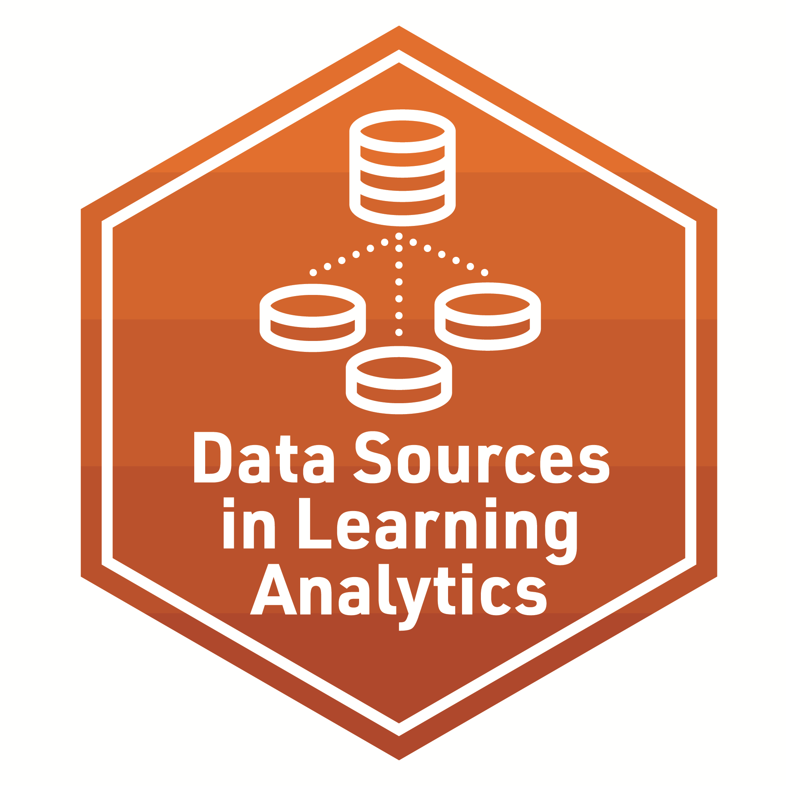

### **Foundation lab 1** - Data Sources

**Required Pre-Reading:**

[Learning Analytics Goes to School, (Ch. 2, pp. 15 - 28) By Andrew Krumm, Barbara Means, Marie Bienkowski](https://github.com/laser-institute/essential-readings/blob/main/foundational-skills/foundlab_1/krumm_2018.pdf)

**Presentation and code-along:**
This presentation is a review of the types of data typically used to perform learning analytics in education. The focus of the essential readings are to introduce LASER Scholars to the most common data structures used in Learning Analytics. We will look closely at Digital Learning Environments, Administrative Data and Sensors / Multimodal. 
The code-along includes introduction of a script file and commonly used packages that read in different data types. Scholars learn to use the readr package from tidyverse to organize data into data frames and tibbles. Additionally, scholars will learn how to read in files using the Haven package.  Written by Jeanne McClure, Catherine Noonan, and Shaun Kellog and Robb Moore. Presented by Jeanne McClure and Jenn Houchins at the Learning Analytics in STEM Education Research (LASER) workshop, July 11, 2022, through July 15, 2022, at the Friday Institute, North Carolina State University.

**Required Work:**
- Make sure to complete the R Programming primers:  [Work with Data](https://rstudio.cloud/learn/primers/2)
- Complete the Badge requirement document [Foundations badge - Data Sources](https://github.com/laser-institute/foundational-skills/tree/master/foundation_lab_1/lab1_badge).
