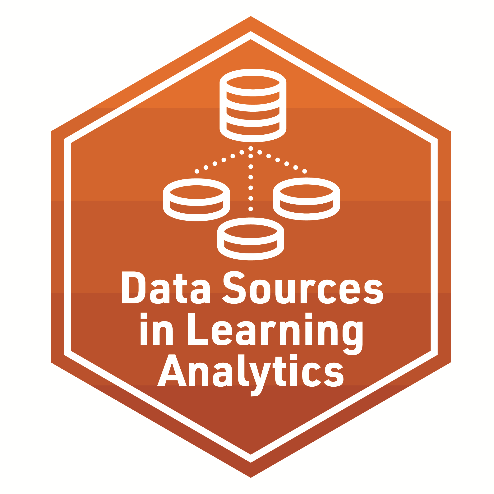
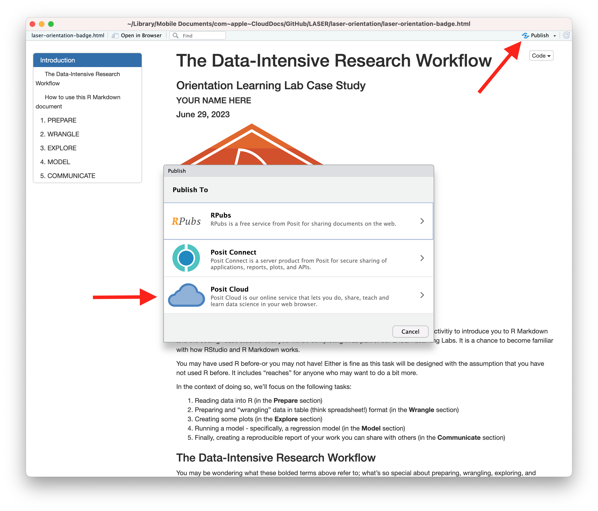

```{r setup, include=FALSE}
knitr::opts_chunk$set(echo = TRUE)
```

{width="30%"}

The final activity for each learning lab provides space to work with data and to reflect on how the concepts and techniques introduced in each lab might apply to your own research.

To earn a badge for each lab, you are required to respond to a set of prompts for two parts:

-   In Part I, you will reflect on your understanding of key concepts and begin to think about potential next steps for your own study.

-   In Part II, you will create a simple data product in R that demonstrates your ability to apply a data analysis technique introduced in this learning lab.

### Part I: Reflect and Plan

Use the institutional library (e.g. [NCSU Library](https://www.lib.ncsu.edu/#articles)), [Google Scholar](https://scholar.google.com/) or search engine to locate a research article, presentation, or resource that applies learning analytics analysis to an educational context or topic of interest. More specifically, **locate a study that makes use of one of the data structures we learned today.** You are also welcome to select one of your research papers.

1.  Provide an APA citation for your selected study.

    -   

2.  What types of data are associated with LA ?

    -   

3.  What type of data structures are analyzed in the educational context?

    -   

4.  How might this article be used to better understand a dataset or educational context of personal or professional interest to you?

    -   

5.  Finally, how do these processes compare with what teachers and educational organizations already do to support and assess student learning?

    -   

Draft a research question of guided by techniques and data sources that you are potentially interested in exploring in more depth.

1.  What data source(s) should be analyzed or discussed?

    -   

2.  What is the purpose of your article?

    -   

3.  Explain the analytical level at which these data would need to be collected and analyzed.

    -   

4.  How, if at all, will your article touch upon the application(s) of LA to "understand and improve learning and the contexts in which learning occurs?"

    -   

### Part II: Data Product

After you finish the script file for [lab1_badge](https://github.com/laser-institute/foundational-skills/tree/master/foundation_lab_1/lab1_badge) add it to the community board.

### Problem 1:

Create a data frame that includes two columns, one named "students" and the other named "foods." The first column should be this vector (note the intentional repeated values): Thor, Rogue, Electra, Electra, Wolverine

The second column should be this vector: Bread, Orange, Chocolate, Carrots, Milk

```{r, problem_1}
# YOUR FINAL CODE BELOW


```

### Problem 2

Using the data frame created in Problem 2, use the table() command to create a frequency table for the column called "students"

```{r, problem_2}
# YOUR FINAL CODE BELOW

```

### Problem 3

Create a vector of five numbers of your choice between 0 and 10, save that vector to an object, and use the sum() function to calculate the sum of the numbers.

```{r, problem_3}
# YOUR FINAL CODE BELOW

```

### Problem 4

a. Create code to read the data/sci-online-classes.csv file into R using function(s) from the tidyverse package. **(Note: this requires the package tidyverse)**. Save the data as an object called **sci_classes**.

b. Examine the contents of sci_classes in your console. **Is your object a tibble? How do you know?** (Hint: Check the output in the console.)

```{r, problem_4}
# YOUR FINAL CODE BELOW

```

### Problem 5

Using the sci_classes data frame:

a.  Select all columns except subject and section.

b.  Assign to a new object with a different name.

c.  Examine your data frame.

```{r, problem_5}
# YOUR FINAL CODE BELOW


```

### Knit & Submit

Congratulations, you've completed your Data Sources Badge!

*Complete the following steps to submit your work for review by:*

Complete the following steps to knit and publish your work:

1.  First, change the name of the `author:` in the [YAML
    header](https://bookdown.org/yihui/rmarkdown-cookbook/rmarkdown-anatomy.html#yaml-metadata)
    at the very top of this document to your name. The YAML header
    controls the style and feel for knitted document but doesn't
    actually display in the final output.

2.  Next, click the knit button in the toolbar above to "knit" your R
    Markdown document to a
    [HTML](https://bookdown.org/yihui/rmarkdown/html-document.html) file
    that will be saved in your R Project folder. You should see a
    formatted webpage appear in your Viewer tab in the lower right pan
    or in a new browser window. Let's us know if you run into any issues
    with knitting.

3.  Finally, publish your webpage on on Posit Cloud by clicking the
    "Publish" button located in the Viewer Pane after you knit your
    document. See screenshot below.

{width="80%"}

### Foundations Learning Badge 1

Congratulations, you've completed Foundations Learning Badge 1! To receive
credit for this assignment and earn the an official Foundations LASER Badge,
share the link to published webpage under an empty **Badge Artifact**
column on the 2023 LASER Scholar Information and Documents spreadsheet:
<https://go.ncsu.edu/laser-sheet>. We recommend bookmarking this
spreadsheet as we'll be using it throughout the year to keep track of
your progress.

{width="80%"}

Once your instructor has checked your link, you will be provided a
physical version of the badge below!

