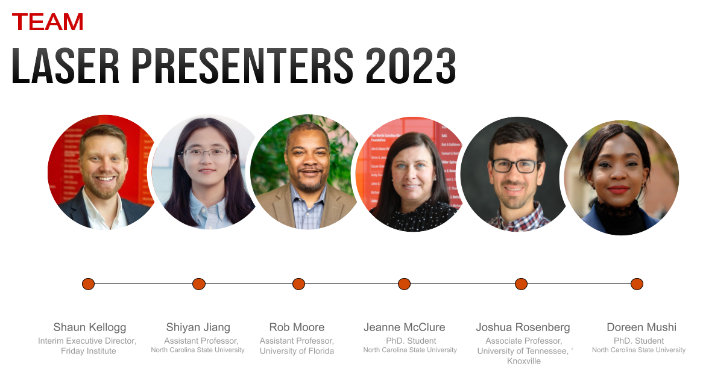

class: clear, title-slide, inverse, center, top, middle

```{r setup, include=FALSE}
knitr::opts_chunk$set(echo = FALSE)
```

```{r, echo=FALSE}
# then load all the relevant packages
pacman::p_load(pacman, knitr)
```

```{r xaringan-panelset, echo=FALSE}
xaringanExtra::use_panelset()
```

```{r xaringanExtra-clipboard, echo=FALSE}
# these allow any code snippets to be copied to the clipboard so they 
# can be pasted easily
htmltools::tagList(
  xaringanExtra::use_clipboard(
    button_text = "<i class=\"fa fa-clipboard\"></i>",
    success_text = "<i class=\"fa fa-check\" style=\"color: #90BE6D\"></i>",
  ),
  rmarkdown::html_dependency_font_awesome()
)
```

```{r xaringan-extras, echo=FALSE}
xaringanExtra::use_tile_view()

```

```{css, echo = F}
table {
  font-size: 12px;     
}
```

# `r rmarkdown::metadata$title`
----
### `r rmarkdown::metadata$author`
### `r format(Sys.time(), "%B %d, %Y")`

---
# Recap from Orientation lab

--

- Well Documented
--

- Clear Communication
--

- Reproducible Theory

???

In the orientation lab we learned about reproducible research. Keep your code well documented, use clear communication and follow the reproducible theory.

We also learned about the open movement and its importance for  reproducible research.

From your pre-reading, Krumm 2018 sums it up nicely stating, "The basic idea
behind the open data movement is that anyone can access or use a data set, and key to this movement is not just accessibility but usability. Making open data usable means making it accessible in machine-readable, structured, granular, and well-documented formats."


---

# Agenda

.pull-left[**Part-1  Conceptual Overview**
- Types of Learning Environments 
- Characteristics of Data (Format)

]

.pull-right[**Part-2  Code-Along**
- Workflow
  + Prepare
    - Context of Case Problem
    - Install/Load Packages
    - Read in Data
    - Inspect Data
]

.footnote[Pre-Reading:
1. [Learning Analytics Goes to School, (Ch. 2, pp 16 - 21 ) By Andrew Krumm, Barbara Means, Marie Bienkowski]()
2. [Educational data mining and learning analytics: An updated survey, By Romero & Ventura]()


]

???
In this session for the conceptual overview we are going to learn more about the types and characteristics of data common in Learning Analytics. Many of these you will be familiar with and some may be new.

In our code-along we will continue with learning how to read in data, using the various packages from `tidyverse`. We will also learn to view data between a tibble and a data frame.
---

class: clear, inverse, middle, center

Part 1:

----

Data Structures: Conceptual Overview


---

# Educational Data

--

- Interaction between instructors and students
--

- Administrative
--

- Demographic data
--

- Student affectivity
--

.pull-center[

]

???
Interaction between instructors and students: (e.g., navigation behavior, input in quizzes, interactive exercises, forum messages,
Administrative data: school and teacher information
Demographic: gender, age,
Student affectivity: motivation, emotional states),


---
# Types of Learning Environments

--

- Face to Face
--

- Blended
--

- Digital (computer aided) Learning Systems
--

.pull-center[

]

???
face-to-face con- tact between educators and students organized through lectures, class discussion, small groups, individual seat work, and so on. Traditional education systems are classified in different levels UNESCO. These
systems gather information on student attendance, marks, curriculum goals, class, schedule information, and so on. Finally, it is important to note that all these traditional systems can also use computer-based educational systems as
a complementary tool to face-to-face sessions.

Digital Learning Systems or Computer use computers in education to provide direction, to instruct or to manage instructions given to the student. The global use of Internet and the application of artificial intelligence (AI) techniques have led to today's plethora of new web-based intelligent educational systems. Gibson and Frietas (2016) suggest the function of technology as an active participant in data generation is significant, as it is involved in the intricate process of data creation. This process stems from the dynamic interplay between the learner and the digital learning environment, as well as from the collaborative data production by the learner, environment, and social context. Such collaborative situations give rise to a wide range of diverse data sources, which exhibit substantial variation. It becomes necessary to harmonize and integrate these distinct data sources together.

Blended (“blended learning,” “hybrid learning,” and “mixed-mode instruction”) combine face-to-face instruction with computer-mediated instruction. Before COVID we saw some use but after COVID we saw an increase in the use of Digital Learning Systems and Blended. 

---

## .font175[.center[What types of Digital Learning Environments (computer Aided) have you used data from?]]


---
# Digital Learning Environments (Computer Aided)


.pull-left[

- **Adaptive and Intelligent Hypermedia System (AIHS)**

- **Intelligent Tutoring System (ITS)**

- Serious Games and Simulations 

- Learning Management System (LMS) 

- **In-Context Learning (ChatGPT/Whisper)**
]

.pull-right[

- Massive Open Online Course (MOOC)

- **Test and quiz system**

- Sensor  Wearable learning systems and Virtual

- Augmented reality systems

- Multimodal Computer Aided Learning

]

???

Adaptive and Intelligent Hypermedia System (AIHS) - These systems attempt to be more adaptive by building a model of the goals, preferences, and knowledge of each individual student and using this model throughout interaction with the student in order to adapt to the needs of that student. The data recorded by AIHs are similar to ITS data.

ITS - ITSs provide direct customized instruction or feedback to students by modeling student behavior and changing its mode of interaction with each student based on its individual model. Normally, it consists of a domain model, student model, and pedagogical model. ITSs record all student-tutor interaction (mouse clicks, typing, and speech).

Test and quiz system - The main goal of these systems is to measure the students' level of knowledge with respect to one or more concepts or subjects by using a series of questions/items and other prompts for the purpose of gathering information from respondents. They store a great deal of information about students' answers, calculated scores, and statistics.


---
class: no-logo

# Characteristics of Data

.panelset[

.panel[.panel-name[Types]


.center[

]
]


.panel[.panel-name[Structured]

```{r round-block, echo=FALSE, warning=FALSE, message=FALSE}
#show first 5 rows
library(tidyverse)
sci_course <- read_csv("data/sci-online-classes.csv")

knitr::kable(head(sci_course), format = 'html')
```

]


.panel[.panel-name[Unstructured]

.center[

]
]

.panel[.panel-name[Semi-Structured]

.center[
          
]
]


.panel[.panel-name[Meta-Data]

.center[

]
]

.panel[.panel-name[Discuss]

.center[
Data is often referred to as the 'lifeblood' of learning analytics. 

In the context of education, what does this analogy mean, and why is data so crucial for the success of learning analytics initiatives?
]

]
]
???

***TYPES-TAB**
In data-intensive research we might acquire data from LMS, SIS or another source. Data maybe to big for a typical  database  software  tools  to  capture,  store,  manage,  and  analyze”

Those data are similar but different because 
1. the tasks that students are engaged in and 
2. how data from those tasks are collected and stored by the technology. 

We identify four main types of data structures.
- structured
- unstructured
- semi-structured and 
- meta-data


**STRUCTURED - TAB**

Structured data is Quantitative in nature
Here we see the rows and columns nice and tidy. 
- data is tidy when each column is a variable, each row is an observation, and each cell is a single value.

We typically have tidy data in Excel files or SQL databases that we can import using the readr function or here function.

- Tabular - relational data. 
Examples might include:
- performance data (current and prior)
- demographic data (student’s ethnic and or group or disability)

Each field (variable) is discrete and can be accessed separately or jointly along with data from other fields (variables).

**UNSTRUCTURED TAB**

Unstructured data is Qualitative in nature
and includes:
- Non-Relational Data
- sensor data, web logs, clickstreams, keystroke capture data, emails, images and videos

Text Heavy relationships between nodes
IE: Audio, video, dates SQL database


**SEMI-*STRUCTURED-TAB**
Semi-structured data includes Qualitative 
Triangular Data (uses surveys and interview answers)
Semi-structured data is a form of structured data that does not conform with the formal structure of data models associated with relational databases or other forms of data tables.

Semi structured can also include log data.

It is a self-describing structure that contains tags
examples: Social media, JSON and XML, Social Networkdata


**META-DATA - TAB**

Not in the readings but something to think about is Meta-data collection, such as the field dates, times and locations of photos, videos and other structured data about data.
 - contexts and purposes for why the data was collected
 
You can read more about the meta data standards on Canada's heritage information network. The link is in the presenters notes. https://www.canada.ca/en/heritage-information-network/services/collections-documentation-standards/chin-guide-museum-standards/metadata-data-structure.html


]

---

class: clear, inverse, middle, center

Part 2:

----

Code-Along

---

# Workflow: Prepare


???
**PREPARE TAB**


**Prepare** for a data-intensive analysis with clear and refined research questions with an understanding of where the data came from. 
For example, Krumm et al uses the example surrounding an activity system for which the technology was used. 

You may ask yourself - Is it for instructional, reward or even a social collaborative context? Having that understanding will allow for more refined understanding when formulating guiding research questions for the analysis. Identify what gets collected and stored by technology is important for the development of the research question.

Here you may even refine your research question after having a better idea of where the data came from. The question may also be refined and redeveloped after you have started the data intensive analysis.

The Learning Analysis Cycle is not a linear process but rather a process of phases that can be moved around.*

**DISCUSS slide**
THis should encourage educational scholars to reflect on the fundamental importance of data in the realm of learning analytics. 

Allowing to delve into the significance of data in shaping insights, understanding student performance, and facilitating data-driven decision-making to enhance the learning experience. Exploring how data empowers educators to identify patterns, predict outcomes, and personalize learning for individual students. 

Bringing in the ethical considerations surrounding data collection, storage, and usage in the context of learning analytics. Hopefully this question will help the scholars recognize the indispensable role of data in driving meaningful educational improvements and student success.

---
# Context of the Problem

Macfadyen, L. P., & Dawson, S. (2010). [Mining LMS data to develop an "early warning system" for educators: A proof of concept.](https://www.sciencedirect.com/science/article/pii/S0360131509002486?via%3Dihub) *Computers & education*, *54*(2), 588-599.

- Explores specific online activities of students indicating their academic success.
- Focused on "early warning systems" in higher education.
- Research was extracted from course-based instructor tracking logs and the BB Vista production server.
- Data Sources
  + A **self-report survey** assessing three aspects of students’ motivation
  + **Log-trace data,** such as data output from the learning management system (LMS)
  + **Academic achievement data**
  + Discussion board data

???
The context for our next couple of days is surrounded by online science classes we explore and were designed and taught by instructors through a state-wide online course provider designed to supplement—but not replace—students’ enrollment in their local school. For example, students may have chosen to enroll in an online physics class because one was not offered at their school.

---
# Load Packages
.panelset[
.panel[.panel-name[install packages]

- First time using a package
- Do this ONLY ONCE in the "console"

```{r eval = FALSE, echo=TRUE, message = FALSE, warning=FALSE}
# Install Packages
install.packages("tidyverse")#<<

```

]

.panel[.panel-name[Your turn]

- Load tidyverse to use
- you do this every time you create a new script/rmd

.code60.remark-code[
```{r echo=TRUE}
# Load tidyverse package 
#
#

```

]]

.panel[.panel-name[ANSWER]

```{r echo=TRUE, warning=FALSE, message=FALSE}
# Load tidyverse package 
library(tidyverse)

```
]
]

---
class: no-logo

# Reading in Data

.panelset[

.panel[.panel-name[readr package]

Common readr functions to read in different types of data

{[readr](https://readr.tidyverse.org)} 

.pull-left[

]

.pull-right[

]

]

.panel[.panel-name[readr]
# Using the readr function

Use `read_csv()` function to read in CSV.
.code60.remark-code[
```{r echo =TRUE, message = FALSE, warning=FALSE}
#use read_csv function to read in sci-online-classes.csv rename object to online_classes

online_classes <- read_csv("data/sci-online-classes.csv") #<<

#use head() function
knitr::kable(head(online_classes, n=5), format = 'html')

```

]]

.panel[.panel-name[YOUR TURN]
# YOUR TURN! Read in excel files

In the corresponding script do the following:
- load in the `readxl` package, 
- load in "data/csss_tweets.xlsx" file save to a new object csss_tweets
- inspect the data by `head()` function

.code60.remark-code[
```{r echo=TRUE, eval = FALSE, warning=FALSE, message=FALSE}
# 1. Install and read in the readxl Package 

# 2. use read_excel() function to read in data/csss_tweets.xlsx
csss_tweets <- 
  
# 3. use head() function to read 
head()
```
]]

.panel[.panel-name[ANSWER]
# read in excel files

Read in with `readxl` package

.code60.remark-code[
```{r echo=TRUE, warning=FALSE, message=FALSE}
#Install and read in the readxl Package 
library(readxl)

#use read_excel() function to read in data/csss_tweets.xlsx
csss_tweets <- read_excel("data/csss_tweets.xlsx")#<<

#use head() function to read 
head(csss_tweets, n = 5)
```
]]

.panel[.panel-name[readxl function]

Check what sheets are included.
To learn more about functions for this package type: ?read_excel in the script.

.code60.remark-code[
```{r echo = TRUE, message = FALSE, warning=FALSE}

excel_sheets("data/csss_tweets.xlsx") #<<

csss_tweets <- read_excel("data/csss_tweets.xlsx", sheet = "Sheet1")#<<


```

```{r}
knitr::kable(head(csss_tweets, n = 5),format = 'html')
```

]
]

???

**PACKAGES-TAB**

In order to read in data we must load packages that allow us to read data in, like we did in foundation lab 1. 
Although there are read-in capabilities with the `utils package` in base r, we are going to use a more modern approach.
One of the packages in Tidyverse allows for reading in Comma delimiter files, or CSV. 


*Reminder if needed - this was discussed in foundation 1*
R comes with several packages in base r when you start a session. Packages are a collection of objects, data sets around a theme or purpose. You may find a package whose objects are for the purpose of correlation, like in the cor package. Or you may find a package that has objects to produce better tables, like in the *kable extra* package. Or you may find a package that will help wrangling the data (processing it) easier than in Base R package. That is the package we are going to install here Tidyverse.

Tidyverse is a suite of packages that share a common philosophy and are designed to work together. Think Google products or Microsoft products. data importing, data wrangling and plotting.


**FUNCTIONS-TAB**

Common functions that are included when you read in data are 
1. the file, we need to give a path to get the data. It should be in the working directory.

2. column names corresponds to variables on the first row. The first row of the input will be used as the column names, and will not be included in the data frame. If FALSE, column names will be generated automatically: X1, X2, X3 etc.

3. NA corresponds to missing values. commonly you will see capital NA but you may also see quotations or only a period depending on the original database (excel, SAS, STATA etc).

4. Skip functions allows you to skill to when your data starts. 

5. col_types is not typically needed but good to know. R guesses what type of column types you have when it reads in the file using the default guess_max.
This is convenient (and fast), but not robust. If the imputation fails, you'll need to increase the guess_max or supply the correct types yourself.

6. guess_max if the imputation fails increase the number beyond the 1000 default to guess col_types correctly.


**READR-TAB**
readr is a quick way to read in comma-separated values (CSV) and tab-separated values (TSV)

- We read in from the path. My data is stored in a folder called data. I then use the assignment operator to save it as a new object called online-classes. 
- (instructor is showing how to import from file) a quick way to see where your data file is stored is by clicking on the file under files and then import. 


**readxl- TAB**
To read in an excel file we will need to install the readxl package and then read in with the read_excel function. We can see that it is an excel file with the .xlsx extension.


**FUNCTIONS-TAB**

You can check what sheets are included in your excel file by calling it with the excel_sheets function. 
Then you can call only that sheet. Our data only includes one sheet so we do not really need to use this function, but it's good to know.
]
---
# Read in data cont.


.panelset[


.panel[.panel-name[url]

Read in a url path with `read_csv2` function.

.code70.remark-code[
```{r echo = TRUE, message = FALSE, warning = FALSE}
air_quality <- read_csv2("https://www4.stat.ncsu.edu/~online/datasets/AirQualityUCI.csv") #<<

```

```{r}
knitr::kable(head(air_quality, n=3),format = 'html')
```

]]


.panel[.panel-name[YOUR TURN ]
# YOUR TURN! Read in STATA

In the corresponding script do the following:
- load in the `haven` package, 
- load in "data/GPA3.dta" file save to a  new object called gpa_dt
- inspect the data with function of your choice
- explain what you see

.code60.remark-code[
```{r echo=TRUE, eval = FALSE, warning=FALSE, message=FALSE}
# 1. Install and read in the haven function 

# 2. use read_excel() function to read in data/GPA3.dta
csss_tweets <- 
  
# 3. Inspect the data
head()
```
]]

.panel[.panel-name[ANSWER]

Read in a Stata file with `read_dta` function
.code70.remark-code[
```{r echo = TRUE}
library(haven)

gpa_dt <- read_dta("data/GPA3.dta") #<<
```
]
]

]
???
**PATH-tab**
You can read in from your computers path. If you aren't sure you go to the file and hold down Shift on your keyboard and right-click on the file.
You would need to change the direction of the slashes so that R can read it in.


**URL-tab**
If you want to read in a url you use the read_csv2 function.


**.dta-TAB**
You may want to read in a SAS, SPSS or Stata file. To do this we would use the Haven package. https://haven.tidyverse.org/

---
# GLOBAL OPTIONS

Let's learn about settings.
.pull-left[
 - 1. `R General` -> (untick) Restore .RData into workspace at startup.
 - 2. `R General` -> Save workspace to .RData on exit: Never
 - 3. `R Markdown` -> Show output preview in: Viewer Pane
]

.pull-right[

]


---

class: inverse, clear, center

## .font130[.pull-left[**What's next?**]]

<br/><br/><br/><br/><br/>

.pull-left-wide[.left[.font100[
- Complete **Independent work today**
- Complete the R Programming primer:  [Work with Data](https://rstudio.cloud/learn/primers/2)
- Complete the Badge requirement document [Foundations badge - Data Sources](https://github.com/laser-institute/foundational-skills/tree/master/foundation_lab_1/lab1_badge).
]]
]

## .font175[.center[Thank you! Any questions?]]


---


---

