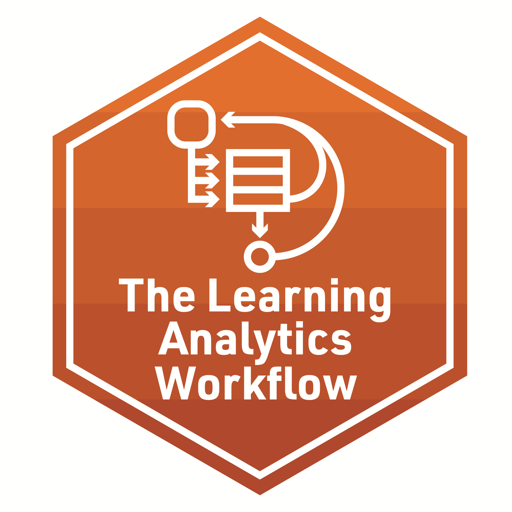

## **Foundation lab 2** - Methods

**Required Pre-Reading:**

1. [Learning Analytics Goes to School, (WRANGLE, Ch. 2, pp 28 - 41) By Andrew Krumm, Barbara Means, Marie Bienkowski](https://laser-institute.github.io/LASER_Foundations_2023//lab2/Readings/Learning%20Analytics%20Goes%20to%20School.pdf)
2. [The journey of learning analytics. By Joksimović, Kovanović & Dawson](https://laser-institute.github.io/LASER_Foundations_2023/lab2/Readings/The_Journey_of_Learning_Analytics.pdf)
3.  [OPTIONAL: R for Data Science, (Ch. 3) by Hadley Wickham & Garrett Grolemund](https://r4ds.had.co.nz/transform.html)

**[Foundation Presentation - Two](https://laser-institute.github.io/LASER_Foundations_2023/lab2/found-lab-2-slides.html#1) and code-along:**
Learning Analytics. The focus of the essential reading dives deep into the Methods commonly found in Learning Analytics.

LEARNING ANALYTICS WORKFLOW

- Predictive Analysis
- Social Network Analytics
- Discourse Analysis
- Text Analysis
- Multimodal Analysis

The accompanying code-along introduces R Markdown and Markdown syntax, as well as the YAML header. Participants will practice preparing and wrangling data, including reading in and tidying data. 

Case Study work includes:
- Wrangle
  + Read in Data
  + Import
  + Tidy
  + Join

**Required Work:**

-  Make sure to complete the R Programming primers:  [Tidy your Data](https://rstudio.cloud/learn/primers/4)

**Badge Requirement**

-  Complete the badge requirement document from your lab 2 folder [foudationlab2_badge - Data Sources]().
