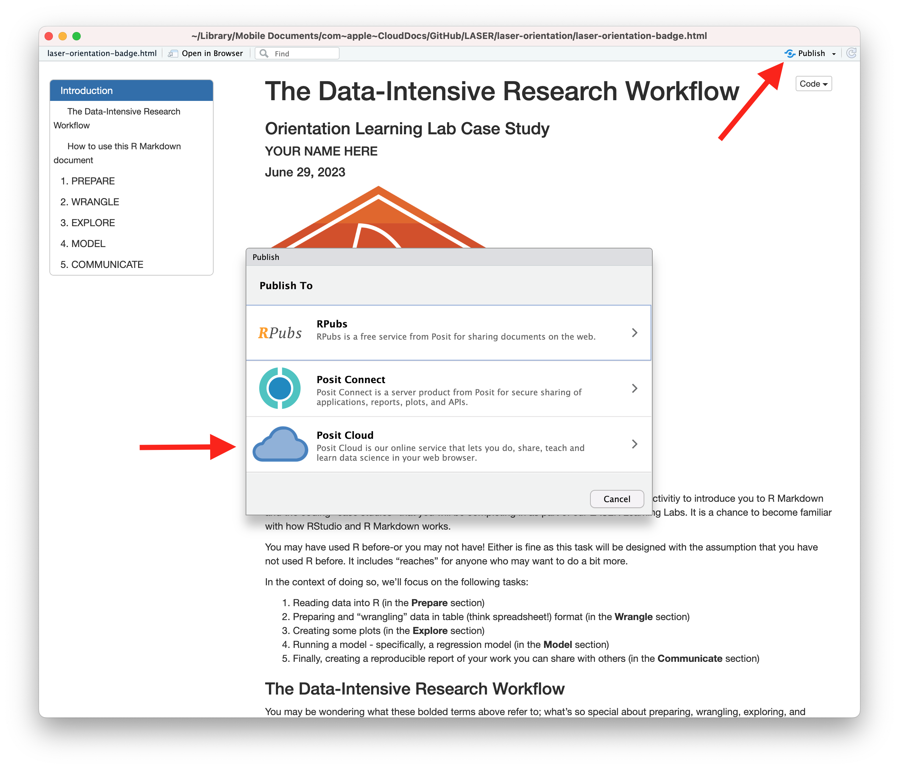

```{r setup, include=FALSE}
knitr::opts_chunk$set(echo = TRUE)
```

{width="30%"}

The final activity for each learning lab provides space to work with data and to reflect on how the concepts and techniques introduced in each lab might apply to your own research.

To earn a badge for each lab, you are required to respond to a set of prompts for two parts: 

-   In Part I, you will reflect on your understanding of key concepts and begin to think about potential next steps for your own study.

-   In Part II, you will complete a few R exercises that demonstrates your ability to apply the first phases of the LA workflow and data wrangling techniques introduced in this learning lab.

### Part I: Reflect and Plan

Use the institutional library (e.g. [NCSU Library](https://www.lib.ncsu.edu/#articles)), [Google Scholar](https://scholar.google.com/) or search engine to locate a research article, presentation, or resource that applies learning analytics analysis to an educational context or topic of interest. More specifically, **locate a study that makes use of the Learning Analytics Workflow we learned today.** You are also welcome to select one of your research papers.

1.  Provide an APA citation for your selected study.

    -   

2.  What educational issue, “problem of practice,” and/or questions were addressed?

    -   


3.  Briefly describe any steps of the data-intensive research workflow that detailed in your article or presentation. 


    -   

4.  What were the key findings or conclusions? What value, if any, might education practitioners find in these results?

    -   

5. Finally, how, if at at, were educators in your self-selected article involved prior to wrangling and analysis?

    -   

Draft a new research question of guided by the the phases of the Learning Analytics Workflow. Or use one of your current research questions.

1.  What educational issue, “problem of practice,” and/or questions is  addressed??

    -   

2.  Briefly describe any steps of the data-intensive research workflow that can be detailed in your article or presentation.
 


3.  How, if at all, will your article touch upon the application(s) of LA to “understand and improve learning and the contexts in which learning occurs?”

    -   

### Part II: Data Product

In our Learning Analytics code-along, we scratched the surface on the number of ways that we can wrangle the data.

Using one of the data sets provided in the data folder, your goal for this lab is to extend the Learning Analytics Workflow from our code-along by preparing and wrangling different data.

*Or alternatively, you may use your own data set to use in the workflow. If you do decide to use your own data set you must include:* 

- *Show two different ways using `select` function with your data, inspect and save as a new object.*

- *Show one way to use `filter` function with your data, inspect and save as a new object.*

- *Show one way using `arrange` function with your data, inspect and save as a new object.*

- *Use the pipe operator to bring it all together.*

Feel free to create a new script in your lab 2 to work through the following problems. Then when satisfied add the code in the code chunks below. Don;t forget to run the code to make sure it works.

**Instructions:**

1. _Add_ your name to the document in author.

2. Set up the first (or, two if using an Introduction) phases of the LA workflow below. I've added the wrangle section for you. You will need to `Prepare` the libraries necessary to wrangle the data.


## Wrangle

3. In the chunk called `read-data`: _Import_ the `sci-online-classes.csv` from the `data` folder and _save_ as a new `object` called `sci_classes`. Then _inspect_ your data using a `function` of your choice.


```{r, read-data}
# Type your code here
```


4. In the select-1 code chunk: Use the 'select' function to  _select_  `student_id`, `subject`, `semester`, `FinalGradeCEMS`. _Assign_ to a new object with a different name (you choose the name).
```{r, select-1}
# Type your code here
```
*

What do you notice about FinalGradeCEMS?(*Hint: NAs?)

- Answer here

5. In code chunk named `select-2` _select_ all columns except `subject` and `section`. _Assign_ to a new object with a different name. _Examine_ your data frame with a different `function`.

```{r, select-2}
# Type your code here
```

6. In the code chunk named `filter-1`, _Filter_ the **sci_classes data** frame for students in OcnA courses. _Assign_ to a new object with a different name. _Use_ the head() function to examine your data frame. 
 
```{r, filter-1}
#Type your code here
```

Q: How many rows does the head() function display?
*Hint: Check the dimensions of your tibble in the console.*

- Answer here


7. In code chunk named `filter-2`, _filter_ the **sci_classes data** frame so rows with NA for points earned are removed. _Assign_ to a new object with a different name. _Use_ glimpse() to examine all columns of your data frame.

```{r, filter 2}
# Type your code here
```

8. In the code chunk called `arrange-1`, _Arrange_ **sci_classes data** by `subject` then `percentage_earned` in descending order. _Assign_ to a new object. _Use_ the str() function to examine the data type of each column in your data frame.

9. In the code chunk name `final-wrangle`, _use_ **sci_classes data** data and the %>% `pipe` operator: 
  + Select `student_id`, `subject`, `semester`, `FinalGradeCEMS`. 
  + Filter for students in OcnA courses.
  + Arrange grades by section in descending order. 
  + Assign to a new object. 
  + Examine the contents using a method of your choosing. 
  
```{r}
#Type your code here
```


### Knit & Submit

Congratulations, you've completed Foundations Badge 2!

*Complete the following steps to submit your work for review by:*

Complete the following steps to knit and publish your work:

1.  First, change the name of the `author:` in the [YAML
    header](https://bookdown.org/yihui/rmarkdown-cookbook/rmarkdown-anatomy.html#yaml-metadata)
    at the very top of this document to your name. The YAML header
    controls the style and feel for knitted document but doesn't
    actually display in the final output.

2.  Next, click the knit button in the toolbar above to "knit" your R
    Markdown document to a
    [HTML](https://bookdown.org/yihui/rmarkdown/html-document.html) file
    that will be saved in your R Project folder. You should see a
    formatted webpage appear in your Viewer tab in the lower right pan
    or in a new browser window. Let's us know if you run into any issues
    with knitting.

3.  Finally, publish your webpage on on Posit Cloud by clicking the
    "Publish" button located in the Viewer Pane after you knit your
    document. See screenshot below.

{width="80%"}

### Foundations Learning Badge 2

Congratulations, you've completed Foundations Learning Badge 2! To receive
credit for this assignment and earn the an official Foundations LASER Badge,
share the link to published webpage under an empty **Badge Artifact**
column on the 2023 LASER Scholar Information and Documents spreadsheet:
<https://go.ncsu.edu/laser-sheet>. We recommend bookmarking this
spreadsheet as we'll be using it throughout the year to keep track of
your progress.

{width="80%"}

Once your instructor has checked your link, you will be provided a
physical version of the badge below!