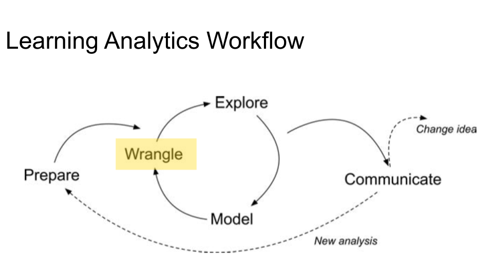
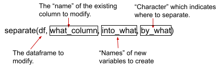
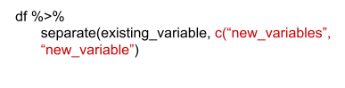
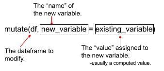
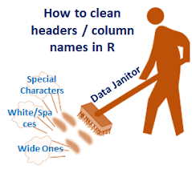
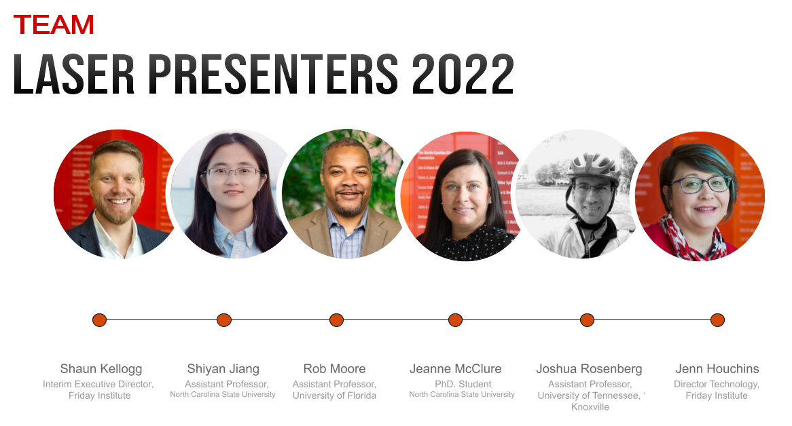

class: clear, title-slide, inverse, center, top, middle

```{r setup, include=FALSE}
knitr::opts_chunk$set(echo = FALSE)
```

```{r, echo=FALSE}
# then load all the relevant packages
pacman::p_load(pacman, knitr, magick)
```

```{r xaringan-panelset, echo=FALSE}
xaringanExtra::use_panelset()
```

```{r xaringanExtra-clipboard, echo=FALSE}
# these allow any code snippets to be copied to the clipboard so they 
# can be pasted easily
htmltools::tagList(
  xaringanExtra::use_clipboard(
    button_text = "<i class=\"fa fa-clipboard\"></i>",
    success_text = "<i class=\"fa fa-check\" style=\"color: #90BE6D\"></i>",
  ),
  rmarkdown::html_dependency_font_awesome()
)
```
```{r xaringan-extras, echo=FALSE}
xaringanExtra::use_tile_view()

```

# `r rmarkdown::metadata$title`
----
### `r rmarkdown::metadata$author`
### `r format(Sys.time(), "%B %d, %Y")`


---
# Recap from Data Structures Presentation

--

- Types of Data Used in LA (Sources)

--

- Characteristics of Data (Format)

???

Before we go on lets take just a few minutes, how are you all feeling so far?
On a quick recap from our data structures presentation we discussed the different types of data found commonly in Learning Analytics. 

**Types of Data** included:

- Digital Learning Environments
  + games 
  + learning management systems
  + Intelligent tutoring systems
  + MOOCs
- Administrative Data
  + Student information Systems
  + statewide longitudinal data systems
- Sensors and Multimodal
  + Sensors
  + Speech and video analysis

**Characteristics of Data** included:
- Structured
  + Quantitative and relational
- Unstructured
  + Qualitative in nature and un-relational
- Semi-Structured
  + Quantitative and Triangular
- Meta-Data
+ Quantitative, data about data.


  
---
# Learning Analytics Workflow Agenda


.pull-left[**Part-1  Conceptual Overview**

- Methods in Learning Analytics

]

.pull-right[**Part-2  Code-Along**

- Workflow 
  + Wrangle
    - Tidy
    - join

]

.footnote[Pre-Reading:
1. [Learning Analytics Goes to School, (Wrangle Ch. 3, pp. 39 - 43) By Andrew Krumm, Barbara Means, Marie Bienkowski]()
2. [The journey of learning analytics. By Joksimović, Kovanović & Dawson]()
3.  [OPTIONAL: R for Data Science, (Ch. 3) by Hadley Wickham & Garrett Grolemund](https://r4ds.had.co.nz/transform.html)
]
---

class: clear, inverse, middle, center

Part 1:

----

Methods used in LA: Conceptual Overview


---
# Methods


--

- Predictive Analysis
--

- Social Network Analytics
--

- Discourse Analysis
--

- Text Analysis
--

- Multimodal Analysis


---
# Predictive Analytics
.panelset[

.panel[.panel-name[Highlights]
.pull-left[
- Forecast future outcomes and behaviors
- Identify students
- Early identification
- Improving student retention
- Personalizing learning experiences
- Optimizing resource allocation
]
]

.panel[.panel-name[Methods]
- Regression Analysis
- Decision Trees
- Random Forest
- Neural Networks
- Support Vector Machines (SVM)
- Time Series Analysis
- Ensemble Methods
]

.panel[.panel-name[Research Scholars]


- George Siemens
- Shane Dawson
- Matt Bernacki 
- Rene Kizilcec
- Ken Koedinger(Cogntitive tutors)


]
]
???
**Predictive Analytics**
- Predictive analysis in learning analytics involves leveraging data to forecast future outcomes and behaviors.
- It enables educators to identify students who may require additional support, interventions, or targeted resources.
- By analyzing various data points such as demographics, engagement patterns, and academic history, predictive analysis helps in early identification and proactive decision-making.
- Benefits of predictive analysis include improving student retention, personalizing learning experiences, and optimizing resource allocation.

**Predictive Analysis** supports student learning by predicting future

- Learning analytics aims to comprehend and enhance the learning process (Macfadyen & Dawson, 2010). Consequently, it is not unexpected that initial investigations predominantly concentrated on establishing predictive frameworks for student retention and academic achievement (Gašević et al., 2015; Siemens, 2013). This emphasis on identifying or foreseeing students who may be at risk of academic failure during the early stages of their academic journey is driven by the economic advantages associated with student retention.

- Course Signals first predictive dashboard by Arnold and Pistilli, 2012
consisted of a predictive model for detecting students’ at-risk of course
failure, and a dashboard which uses a traffic light analogy to visualise
individual students’ risk of failure (i.e., green–no risk, yellow–moderate risk,
red–high risk). The predictive model underpinning the Course Signals
software is based on a wide range of variables including, LMS engagement
activity, demographics, and past academic performance

EXAMPLE METHODS: 
Regression Analysis: Regression analysis is a statistical technique that examines the relationship between a dependent variable and one or more independent variables. It helps identify and quantify the influence of different variables on the outcome of interest. Linear regression, logistic regression, and polynomial regression are some examples of regression analysis used in predictive analytics.

Decision Trees: Decision trees are a popular machine learning method used in predictive analytics. They create a flowchart-like structure to represent decisions and their possible consequences. By splitting the data based on different features, decision trees can predict outcomes by following a path of decisions and conditions.

Random Forest: Random forest is an ensemble learning method that combines multiple decision trees to make predictions. It generates a large number of decision trees and aggregates their predictions to reach a final outcome. Random forest helps reduce overfitting and improves the accuracy and stability of predictions.

Neural Networks: Neural networks are a class of machine learning algorithms inspired by the structure and functioning of the human brain. They consist of interconnected nodes or "neurons" that process and transmit information. Neural networks can learn patterns and relationships in complex datasets, making them suitable for predictive analysis tasks.

Support Vector Machines (SVM): SVM is a supervised machine learning algorithm used for classification and regression analysis. It maps data points into a high-dimensional space and separates them into different classes or predicts numerical values based on their position relative to decision boundaries. SVM is effective in handling both linear and non-linear relationships in the data.

Time Series Analysis: Time series analysis is used when dealing with data that is ordered chronologically, such as stock prices, weather data, or student performance over time. This method captures patterns and trends in the data and makes predictions based on historical patterns, seasonality, and other time-related factors.

Ensemble Methods: Ensemble methods combine multiple predictive models to improve accuracy and robustness. These methods include techniques like bagging, boosting, and stacking, where predictions from multiple models are combined or weighted to produce a final prediction. Ensemble methods help overcome biases and increase the overall performance of predictive models.

---
# Social Network Analysis
.panelset[

.panel[.panel-name[Higlights]
.pull-left[
- Social interactions and collaborations
- How learners learn together
  (Interaction and Knowledge sharing)
- Social dynamics
- Identifying influential learners
  promoting peer support
]
]

.panel[.panel-name[Methods]
- Ego network Analysis
- Complete Network Analysis
  + Centrality Measures
  + Network Density
  + Clustering Coefficient
  + Network Visualization
  + Community Detection

]
.panel[.panel-name[Research Scholars]

.left-column[
*Pdf with links to each scholar is in the "Readings" folder*
]
.right-column[

]

]
]

???

**SOCIAL Network ANALYTICS**

- Social Network analytics involves understanding student interactions through social network analysis. 
Social network analysis (SNA) has emerged as a fundamental approach in learning analytics research. SNA in learning analytics involves extracting peer interactions from online forums to assess students' sense of community, examining creative capacity, exploring the relationship between learners' social centrality and learning outcomes, and visualizing and analyzing patterns in interactions from social learning activities between students and teachers, among other research objectives.

- Social learning analytics examines social interactions and collaborations among learners in educational settings.
- It focuses on analyzing data from discussion forums, collaborative platforms, and social networks to gain insights into how learners learn together.
- By understanding patterns of interaction, knowledge sharing, and social dynamics, social learning analytics can enhance collaborative learning environments.
- Benefits of social learning analytics include identifying influential learners, promoting peer support, and facilitating effective knowledge construction.

EXAMPLE METHODS:
Ego Network Analysis: analysis of individual noses. individual behavior and its variation is mined and described. Egos can be persons, community or  whole societies.

Complete Network Analysis: analysis of relationships of all nodes. Can include sub analysis that may include:

Centrality Measures: Centrality measures help identify influential individuals or entities within a social network. These measures quantify the importance or prominence of a node based on its position in the network. Examples of centrality measures include degree centrality (number of connections), betweenness centrality (ability to control information flow), and closeness centrality (proximity to other nodes).

Network Density: Network density measures the extent of connections within a social network. It calculates the proportion of all possible connections that actually exist in the network. High network density indicates a more interconnected and cohesive network, while low density suggests more fragmented or disconnected relationships.

Clustering Coefficient: The clustering coefficient measures the extent to which nodes in a network tend to cluster or form tightly-knit groups. It assesses the presence of cohesive subgroups within the network. Higher clustering coefficients indicate stronger local cohesion and community structure.

Network Visualization: Network visualization techniques are used to represent and visualize social networks graphically. These visualizations help in understanding the structure, patterns, and relationships within a social network. Nodes and edges are typically depicted, with different colors or sizes indicating various attributes or centrality measures.

Community Detection: Community detection methods identify groups or communities of closely interconnected nodes within a social network. These methods use algorithms to group nodes with similar connections or patterns of interaction. Community detection helps uncover hidden structures, subgroups, or clusters within the network.


---
# Discourse Analysis
.panelset[

.panel[.panel-name[Highlights]
.pull-left[

- Language and communication
- Structure, content, and 
  dynamics of conversations, discussions, 
  and debates.
- Learners engage in critical thinking
- Learning processes, and knowledge co-construction
]
]
.panel[.panel-name[Methods]
- Counting average sentence length
- Number of long words
- Length of essay
- Latent semantic analysis
  + Identification of Features
- CohMetrix and Cross Recurrence Quantification Analysis
  + Cognitive Complexity

]

.panel[.panel-name[Research Scholars]

- Carolyn Penstein Rosé
- Arthur C. Graesser
- Gijsbert Erkens
- Nia Dowell
- JR Martin (linguist)
- Dan Jurafsky (linguist)


]

]
???

**DISCOURSE ANALYSIS**
- Discourse Analysis is a type of learning analytics that focuses on using textual discourse data for supporting student learning. It focuses on studying language in use, specifically the analysis of spoken or written communication in its broader context. Its primary application lies in analyzing students' online communications, including transcripts of their online discussions, chat room interactions, and communications across various social media platforms such as Twitter, Facebook, and blogs. Analysis of student communication transcripts and linguistically modelling student dialogue provides ways of capturing social aspects of student learning.

- Discourse analysis involves analyzing language and communication in educational contexts.
- It examines the structure, content, and dynamics of conversations, discussions, and debates.
- Discourse analysis helps understand how learners engage in critical thinking, construct arguments, and develop shared understanding.
- It provides insights into learning processes, knowledge co-construction, and the development of reasoning and communication skills.

EXAMPLE METHODS: 
Discourse analysis is a qualitative research method
Critical Discourse Analysis (CDA): CDA examines how power, ideology, and social structures influence language use. It aims to uncover hidden meanings, dominant ideologies, and social inequalities embedded in discourse. CDA often explores the relationship between language, power, and social change.

Conversation Analysis (CA): CA studies the organization and structure of talk-in-interaction. It focuses on the sequential and turn-taking aspects of conversation, analyzing the patterns, rules, and practices that govern how people speak, respond, and interpret each other's utterances. CA is commonly used to analyze naturally occurring conversations.

Discursive Psychology: Discursive psychology explores how language is used to construct social realities, identities, and psychological phenomena. It investigates the discursive practices through which individuals interpret and make sense of their experiences. Discursive psychology often employs conversation analysis and discourse analysis methods.

---
# Text Analysis
.panelset[

.panel[.panel-name[Highlights]
.pull-left[

- Analyzing written language
- Extract meaningful insights
- Assess factors
- Benefits of text analysis
]
]
.panel[.panel-name[Methods]
- Sentiment Analysis
- Topic Modeling
- Text Classification
- Text Mining
- Natural Language Processing
- Text Based Social Network Analysis

]
.panel[.panel-name[Research Scholars]

- Srećko Joksimović
- Shiyan Jiang
- Ryan Baker
- Alyssa Wise
- Danielle S. McNamara


]
]

???

**Text Analysis**

- On the other hand, text analysis, examines written or spoken texts to identify patterns, themes, and structures within the text itself. Text analysis typically involves quantitative techniques to analyze large sets of texts, using coding and categorization schemes to extract relevant information and gain insights into the content.


- Text analysis techniques involve analyzing written language in educational contexts.
- Natural language processing (NLP) algorithms are used to extract meaningful insights from text data, such as essays, assignments, and online discussions.
- Text analysis can assess factors like coherence, vocabulary, and argumentation, enabling automated essay scoring and feedback generation.
- Benefits of text analysis include scalable assessment, consistent feedback, and improved writing instruction.

Sentiment Analysis: Sentiment analysis, also known as opinion mining, aims to determine the sentiment expressed in text data. It involves classifying text as positive, negative, or neutral, providing insights into learners' attitudes, emotions, and perceptions. Sentiment analysis can be applied to analyze feedback, forum posts, or written reflections to gauge students' sentiment towards the learning experience or course materials.

Topic Modeling: Topic modeling is a statistical technique used to identify underlying themes or topics within a large collection of text documents. It helps uncover the main ideas, concepts, and recurring patterns in textual data. Topic modeling can be applied to analyze student essays, discussion forum posts, or open-ended survey responses to understand the themes and knowledge domains relevant to learning.

Text Classification: Text classification involves categorizing text documents into predefined categories or classes based on their content. It can be used to automatically classify student assignments, essays, or written responses into different categories or levels of proficiency. Text classification allows for scalable assessment and provides insights into students' mastery of specific concepts or skills.

Text Mining: Text mining refers to the process of extracting valuable information or patterns from text data. It involves techniques such as information retrieval, text summarization, and keyword extraction. Text mining can be used to analyze large collections of educational texts, such as textbooks, research papers, or online resources, to identify relevant concepts, key terms, or trends.

Natural Language Processing (NLP): Natural Language Processing encompasses a range of techniques that enable computers to understand and process human language. NLP techniques, such as named entity recognition, part-of-speech tagging, and syntactic parsing, can be applied in learning analytics to analyze and understand the grammatical structure, relationships, and semantic meaning of text data.

Text-based Social Network Analysis: Text-based social network analysis involves analyzing text-based communication, such as emails, discussion forum posts, or chat logs, to identify social networks and communication patterns within educational communities. It helps understand the structure of social interactions, information flow, and the emergence of influential individuals or communities within learning environments.

**Comparing Discourse vs Textual Analysis**

- While both discourse analysis and text analysis involve analyzing language, discourse analysis emphasizes the social and contextual aspects of communication, whereas text analysis focuses more on examining the content and structure of the text itself. They can be complementary approaches, with discourse analysis providing a deeper understanding of the meaning-making processes within social contexts, while text analysis provides systematic and quantitative insights into textual data.

---
# Multimodal

.panelset[
.panel[.panel-name[Highlights]
.pull-left[
- Multiple modalities
- Learners' experiences
- Enhances understanding
- Benefits of multimodal analysis

]
]
.panel[.panel-name[Methods]

- Multimodal Fusion
- Gesture and Movement Analysis
- Speech and Audio Analysis
- Visual Analysis
- Physiological and Sensor Data Analysis
- Multimodal Visualization

]
.panel[.panel-name[Research Scholars]

- Xavier Ochoa
- Dragan Gasevic
- Paulo Blikstein
- Susanne P. Lajoie
- Katrien Verbert
- Marcelo Worsley
- Cynthia D'Angelo

]

]

???

**MultiModal Analysis**
- an approach able to provide more specific learning models to account for alternate learning designs and teaching practices. Multimodal learning analytics employs diverse data sources to enhance the understanding of learning across different environments, encompassing both in-person and online educational settings. Multimodal learning analytics aims to gather complementary forms of learning-related data, enabling a comprehensive intricacies involved in the learning processes. This analysis tend to go beyond more traditional trace and survey data to incorporate various sensor data streams that capture gestures, gaze, or speech.

- Multimodal analysis integrates and analyzes data from multiple modalities (e.g., text, audio, video, sensor data) to understand learning processes holistically.
- It provides a comprehensive view of learners' experiences, incorporating their verbal, non-verbal, and physiological cues.
- Multimodal analysis enhances understanding of engagement, comprehension, and problem-solving skills in various educational contexts.
- Benefits of multimodal analysis include personalized interventions, adaptive learning, and deeper insights into learners' cognitive and affective states.

---


class: clear, inverse, middle, center
Part 2:

----

Code-Along


---
# WORKFLOW: Wrangle



???

**WRANGLE  TAB**

Wrangling or sometimes called "munging or pre-processing" entails the work of manipulating, cleaning, transforming, and merging data.
- **manipulating** involves identifying, acquiring, and importing data into analysis software.

- Wickham & Grolemund suggest cleaning data involves ensuring that each variable is in its own column, each observation is in its own row, and each value

is in its own cell within a dataset.
This is called Tidying your data and is part of the philosophy that informs the tidyvers suite.

  + Krumm et al adds that **data cleaning** also involves identifying and remediating missing data, extreme values, and ensuring consistent use of identifier, key, or linking variables.
-  transforming variables, such as recoding
categorical variables and rescaling continuous variables.   
+ These types of transformations are the initial building blocks for **exploratory data analysis**

-  One of the biggest value add ons is merging once disparate data sources.

  + For example: merging data from a student information system that stores student grades with data from a digital learning environment that stores students’ longitudinal interactions can unlock what student do and do not do on a day to day basis.
  
---
#First Prepare

.code80.remark-code[
```{r eval=FALSE, echo=TRUE, warning=FALSE, message=FALSE}

#load Library
library(tidyverse)

#load with read_csv package
time_spent <- read_csv("data/log-data.csv")
gradebook <- read_csv("data", "gradebook-summary.csv")
survey <- read_csv("data", "survey.csv")

```
]

---
# Workflow: WRANGLE

1. **Import**
2. **Tidy**
3. **Separate**
3. **Join**


---
#Tidy

.center[

]

---
#Separate
.panelset[
.panel[.panel-name[function]

.pull-left[

]

.pull-right[


]
]


.panel[.panel-name[your turn]
In your corresponding script mutate the time from minute to hours.
```{r echo=TRUE}
#
#
#
```
]

.panel[.panel-name[answer]
.code70.remark-code[
```{r eval=FALSE, echo=TRUE, message=FALSE, warning=FALSE}
time_spent %>%  
  separate(course_id,
           c("subject", "semester", "section"))


knitr::kable(head(time_spent, n=5), format = 'html')

```
]]
]
---
# Mutate

.panelset[
.panel[.panel-name[function]

.pull-left[


]

.pull-right[

]

]

.panel[.panel-name[your turn]
In your corresponding script mutate the time from minute to hours.
```{r echo=TRUE}
#
#
#
```
]

.panel[.panel-name[answer]
.code70.remark-code[
```{r eval=FALSE, echo=TRUE, warning=FALSE, message=FALSE}
# mutate minutes to hours on time spent and save as new variable.
time_spent <- time_spent %>% 
  mutate(time_spent_hours = time_spent / 60)
time_spent_2
```
]
]
]

---
#Join

.center[

]

---
#Janitor Package

{[Janitor](packagehttps://cran.r-project.org/web/packages/janitor/vignettes/janitor.html)}
.center[

]


???


Today we will focus on *Wrangle* phases. **Wrangle**: Wrangling data entails the work of manipulating, cleaning, transforming, and merging data. 


**PREPARE TAB**
In this part of the workflow, **Prepare**, load your libraries. If this is the first time using the library then you will need to install first using the 'install.packages("")' function before using the `library()` function. Add the required data needed for analysis.


**WRANGLE TAB**
About 45- 50%% of your time is spent in cleaning the data.

In general, data wrangling involves some combination of cleaning, reshaping, transforming, and merging data (Wickham & Grolemund, 2017). The importance of data wrangling is difficult to overstate, as it involves the initial steps of going from raw data to a dataset that can be explored and modeled (Krumm et al, 2018). 

In the wrangle section we are going to:

a.  **Import Data**. In this section, we introduce the `read_csv()` function for working with CSV files and revisit some key functions for inspecting our data.

b.  **Tidy Data**. We introduce the `separate()` and `clean_names()` functions for getting our data nice and tidy, and revisit the `mutate()` for creating new variables.

c.  **Join Data**. We conclude our data wrangling by introducing  a`join()` function for merging our processed files into a single data frame for analysis.


**TIDY TAB**

There are a lot of functions in dplyr that help you to solve specific problems We will be using the seperate and mutate functions. 

1. we will load `time_spent` and run the `separate()` function with
the `course_id` variable to split up the subject, semester, and section
so we can use them later on. In other words, whereas above we separated
the variable `course_variable`, in the data set we'll use here, we'll
separate the `course_id` variable.

Once we've processed the data how we
would like, we have to assign, or save, the results back to the name for
the data with which we have been working. This is done with the
assignment operator, or the \<- symbol.

2. We'll use
`mutate()` to create a new variable for the percentage of points each
student earned; keep in mind as you work through these steps how so many
parts of wrangling data involves either changing a variable or creating
a new one. For these purposes, mutate can be very helpful. 

Let's process `time_spent` variable that is in number of *minutes* that students spent on the
course LMS. We will change it to
`time_spent_hours`, that represents the number of *hours* that students spent on the course LMS.

We will also process gradebook data and  Survey data - which we will use a new package called janitor. 

Let's look at the survey data again. We notice that the data You may noticed that `student_ID` is not formatted the same as `student_id` in our other files. This is important because in the next section when were "join," or merge, our data files, these variables will
need to have identical names.

Fortunately the
{[janitor](https://garthtarr.github.io/meatR/janitor.html)} package hassimple functions for examining and cleaning dirty data. It was builtwith beginning and intermediate R users in mind and is optimized foruser-friendliness. There is also a handy function called `clean_names()`in the {janitor} package for standardizing variable names.


**JOIN TAB**
Next, we will join the data together. There are many different join functions that can be used to join data sets.

You may already be aware that your single
analysis involves multiple data files.

While in some cases it is
possible to analyze each data set individually, it is often useful (or
necessary, depending upon your goal) to join these sources of data
together. This is especially the case for learning analytics research,
in which researchers and analysts often are interested in understanding
teaching and learning through the lens of multiple data sources,
including digital data, institutional records, and survey data, among
other sources. In all of these cases, knowing how to promptly join
together files---even files with tens of thousands of hundreds of
thousands of rows---can be empowering.

A key (pun intended) with joins is to consider what variable(s) will
serve as the *key*. This is the variable to join by.

A key must have two characteristics; it is:

-   a character string--- a word (thus, you cannot join on a number
    unless you "coerce" or change it to be a character string, first)

-   present in both of the data frames you are joining.

To join two datasets, it is important that the *key* (or *keys*) on
which you are joining the data is formatted identically. The key
represents an identifier that is present in both of the data sets you
are joining. For instance, you may have data collected from (or created
about) the same students that are from two very different sources, such
as a self-report survey of students and their teacher-assigned grades in
class.

While some of the time it takes some thought to determine what the key
is (or what the keys are---you can join on multiple keys!), you need just one variable that meets both of the above
characteristics.

We're going to use a single join function, `full_join()`. In
the code below, join `gradebook` and `time_spent`; type the names of
those two data frames as arguments to the `full_join()` function in a
similar manner as in the `full_join()` code above, and then run this
code chunk. For now, don't specify anything for the `by =` part of the
function.

You may notice a message in the console or first output box above that
says `Joining, by = c("student_id", "Course", "Subject", "Section")`.
This is telling us that these files are being joined on the basis of all
four of these variables matching in both data sets; in other words, for
rows to be joined, they must match identically on all four of these
variables.


For more on joins:
<https://statisticsglobe.com/r-dplyr-join-inner-left-right-full-semi-anti>

GREAT job on wrangling your data!

]


---

class: inverse, clear, center

## .font130[.pull-left[**What's next?**]]

<br/><br/><br/><br/><br/>

.pull-left-wide[.left[.font100[
-  Make sure to complete the R Programming primers:  [Tidy your Data](https://rstudio.cloud/learn/primers/4)

-  Complete the badge requirement document from your lab 2 folder [foudationlab2_badge - Data Sources](https://github.com/laser-institute/foundational-skills/blob/master/foundation_lab_2/foundationlab2_badge.Rmd).
]]
]

## .font175[.center[Thank you! Any questions?]]


---



---
