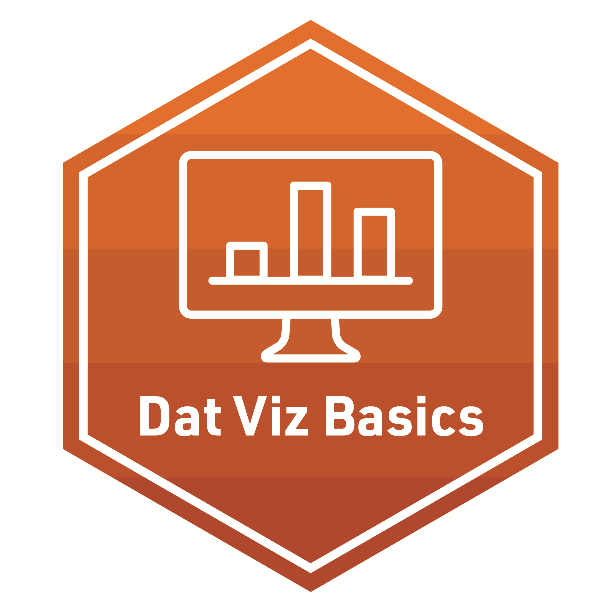

## **Foundation-lab 3** - Power of Data Viz

**Required Pre-Reading:**

1.[Learning Analytics Goes to School, (Explore, Ch. 3, pp. 43 - 49) By Andrew Krumm, Barbara Means, Marie Bienkowski](https://laser-institute.github.io/LASER_Foundations_2023/lab3/Readings/Learning Analytics Goes to School.pdf)
2.[R for Data Science, (Ch. 3 & 7) by Hadley Wickham & Garrett Grolemund](https://r4ds.had.co.nz/index.html)
3.[SKIM: Data Visualization: A practical Introduction (Ch. 1 & 3) by Kieren Healy](https://socviz.co/)

**[Foundations Presentation - Three](https://laser-institute.github.io/LASER_Foundations_2023/lab3/found-lab-3-slides.html#1) and code-along:**
The overview introduces and reviews some of the basic principles of data visualization as it relates to data graphics, including data visualization perception and color.

DATA VISUALIZATION in LA

- Benefits of Data Visualization
- Types of Data Visualization 
- Real-world Examples of Data Viz 
- Best Practices

The accompanying code-along takes a deep dive into the ggplot2 grammar in a simple-to-understand layering approach. We will look at a representation of numeric variables using some of the most popular geoms, histogram and scatter plot, and put it all together to answer a research question. At the end of this code-along participants will understand the "hows" of ggplots aesthetics. 

Case Study work includes:
- EXPLORE
  + `ggplot2` grammar
  + Scatter plot
  + Histogram

**Required Work:**

-  Make sure to complete the R Programming primer: [Introduction to data visualization](https://rstudio.cloud/learn/primers/3))

**Badge Requirement**

-  Complete the badge requirement document from your lab 3 folder [foundationlab3_badge- Data Visualization](https://laser-institute.github.io/LASER_Foundations_2023/lab3/found-lab-3-badge.html).
