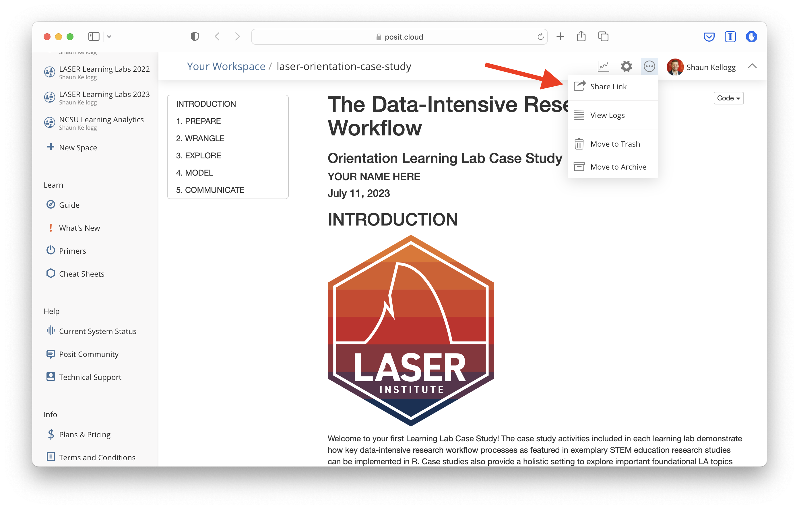

```{r setup, include=FALSE}
knitr::opts_chunk$set(echo = TRUE)
```

{width="30%"}
The final activity for each learning lab provides space to work with data and to reflect on how the concepts and techniques introduced in each lab might apply to your own research.

To earn a badge for each lab, you are required to respond to a set of prompts for two parts: 

-   In Part I, you will reflect on your understanding of key concepts and begin to think about potential next steps for your own study.

-   In Part II, you will create a simple data product in R that demonstrates your ability to apply a data analysis technique introduced in this learning lab.

### Part I: Reflect and Plan

Use the institutional library (e.g. [NCSU Library](https://www.lib.ncsu.edu/#articles)), [Google Scholar](https://scholar.google.com/) or search engine to locate a research article, presentation, or resource that applies learning analytics analysis to an educational context or topic of interest. More specifically, **locate a study that makes use of one of the data structures we learned today.** You are also welcome to select one of your research papers.

1.  Provide an APA citation for your selected study.

    -   

2.  What educational issue, “problem of practice,” and/or questions were addressed?

    -   


3.  What are some common approaches EDA approaches used and what did they entail?


    -   

4.  How were data visualization or feature engineering used to support analysis, if at all?What were the key findings or conclusions?

    -   
5. Finally,  what value, if any, might education practitioners find in these results?

    -   

Draft a new research question of guided by the the phases of the Learning Anlytics Workflow. Or use one of your current research questions.

1.  What educational issue, “problem of practice,” and/or questions is  addressed??

    -   

2.  Briefly describe any steps of the EDA approach that will be used..
 
    - 

3.  What elements of EDA might require human judgement and decision making?

    -   

### Part II: Data Product

In our Learning Analytics code-along, we only scratched the surface on the number of ways that we can wrangle the data.

Using one of the data sets provided in the data folder, your goal for this lab is to extend the Data Visualizations using `ggplot` for Learning Analytics. 
You have three options for completing the Data Product portion:
You can create the visualization exercise provided.
Create a visualization of your choice using a data set from the data folder 
Create a visualization using your own data.


I highly recommend creating a new R script in your lab-3 folder to complete this task. When your code is ready to share, use the code chunk below to share the final code for your model and answer the questions that follow.

Exercise 1:
- Using the `sci-online to create a basic visualization that:
  + Examine the relationship between two categorical variables.
  + Add an appropriate title to your chart.
  + Add a caption that poses a question educators may have about this data that your visualization could help answer.


```{r, data-viz1}
# YOUR FINAL CODE HERE
```


Exercise 2:
- Using the `sci-online to create a basic visualization that:
  + examines the relationship between two continuous variables. (scatterplot with layers, 
#' a log-log or line plot, or one using coord functions.)
  + Add an appropriate title to your chart.
  + Add a caption that poses a question educators may have about this data that your visualization could help answer.
  + Add or adjust any aesthetics to improve the 
  readability of visual appeal of your viz. 
  + Use a color scale if appropriate to modify the  default colors used by ggplot. 
  + Adjust or remove your legend as appropriate. 

```{r, data-viz2}
# YOUR FINAL CODE HERE
```

### Knit & Submit

Congratulations, you've completed your FOundations badge 3 - Data Viz!

*Complete the following steps to submit your work for review by:*

Complete the following steps to knit and publish your work:

1.  First, change the name of the `author:` in the [YAML
    header](https://bookdown.org/yihui/rmarkdown-cookbook/rmarkdown-anatomy.html#yaml-metadata)
    at the very top of this document to your name. The YAML header
    controls the style and feel for knitted document but doesn't
    actually display in the final output.

2.  Next, click the knit button in the toolbar above to "knit" your R
    Markdown document to a
    [HTML](https://bookdown.org/yihui/rmarkdown/html-document.html) file
    that will be saved in your R Project folder. You should see a
    formatted webpage appear in your Viewer tab in the lower right pan
    or in a new browser window. Let's us know if you run into any issues
    with knitting.

3.  Finally, publish your webpage on on Posit Cloud by clicking the
    "Publish" button located in the Viewer Pane after you knit your
    document. See screenshot below.

{width="80%"}

### Foundations Learning Badge 3

Congratulations, you've completed Foundations Learning Badge 3 - Data Viz! 

To receive
credit for this assignment and earn the an official Foundations LASER Badge,
share the link to published webpage under an empty **Badge Artifact**
column on the 2023 LASER Scholar Information and Documents spreadsheet:
<https://go.ncsu.edu/laser-sheet>. We recommend bookmarking this
spreadsheet as we'll be using it throughout the year to keep track of
your progress.

{width="80%"}

Once your instructor has checked your link, you will be provided a
physical version of the badge below!