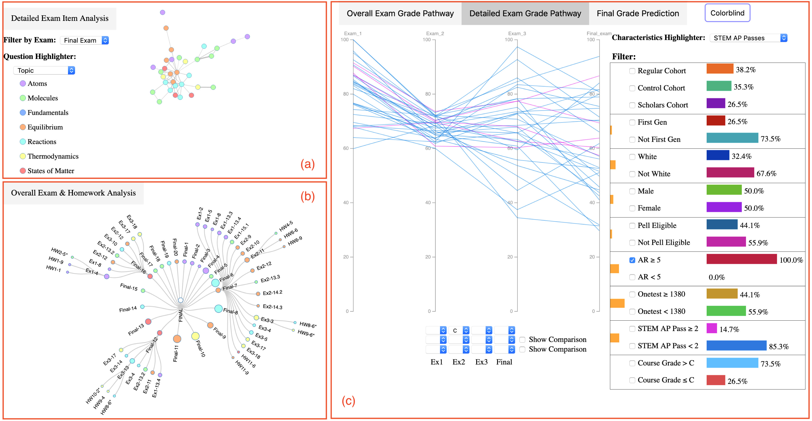

class: clear, title-slide, inverse, center, top, middle

```{r setup, include=FALSE}
knitr::opts_chunk$set(echo = FALSE)
```

```{r, echo=FALSE}
# then load all the relevant packages
pacman::p_load(pacman, knitr, tidyverse, here)

```

```{r xaringan-panelset, echo=FALSE}
xaringanExtra::use_panelset()
```

```{r xaringanExtra-clipboard, echo=FALSE}
# these allow any code snippets to be copied to the clipboard so they 
# can be pasted easily
htmltools::tagList(
  xaringanExtra::use_clipboard(
    button_text = "<i class=\"fa fa-clipboard\"></i>",
    success_text = "<i class=\"fa fa-check\" style=\"color: #90BE6D\"></i>",
  ),
  rmarkdown::html_dependency_font_awesome()
)
```
```{r xaringan-extras, echo=FALSE}
xaringanExtra::use_tile_view()

```

# `r rmarkdown::metadata$title`
----
### `r rmarkdown::metadata$author`
### `r format(Sys.time(), "%B %d, %Y")`

---
# Recap from Lab 2 - LA Methods

- Predictive Analysis

--
- Social Learning Analytics

--
- Discourse Analysis

--
- Text Analysis

--
- Multimodal Analysis

---
# Agenda

.pull-left[**Part-1  Conceptual Overview**


- Benefits of Data Visualization
- Types of Data Visualization 
- Real-world Examples
- Best Practices
]

.pull-right[**Part-2  Code-Along**

- Explore phase
- `ggplot2` grammar
- Scatter plot
- Histogram
]

.footnote[Pre-Readings
1. [Learning Analytics Goes to School, (Explore Ch. 3, pp. 43 - 49) By Andrew Krumm, Barbara Means, Marie Bienkowski](https://github.com/laser-institute/essential-readings/blob/main/foundation_labs/foundlab_1/krumm_2018.pdf)
2. [Data Visualization: A practical Introduction (Ch. 1 & 3) by Kieren Healy](https://socviz.co/)
3. [R for Data Science, (Ch. 3 & 7) by Hadley Wickham & Garrett Grolemund](https://r4ds.had.co.nz/index.html)
]

---

class: clear, inverse, middle, center

Part 1:

----

Power of Data Visualization: Conceptual Overview

---
class: inverse
# What is Data Visualizations?

.center[

]

???
Data visualization plays a crucial role in understanding and analyzing complex educational data by presenting information in a visual format that is intuitive, accessible, and easy to comprehend

Simplifies Complex Data: Educational data often comprises vast amounts of information from various sources, such as student performance, demographics, learning activities, and assessments. Data visualization simplifies this complexity by condensing large datasets into visual representations that are easier to grasp and interpret. It enables researchers and educators to identify patterns, trends, and outliers in the data efficiently.

What do you think are some of the benefits of data visualization in Education?


---
# Benefits of Visualization

--
- Enhancing Understanding

--
- Promoting Engagement

--
- Informing Decision-making

--
- Strengthening Communication

???


**ENHANCING UNDERSTANING**
Visuals have a powerful impact on human cognition. By representing data visually, complex relationships and trends become more apparent, allowing individuals to grasp the underlying information quickly. Visualizations enable stakeholders, including researchers, educators, and administrators, to comprehend and communicate data insights effectively, facilitating data-driven decision-making processes.

**PROMOTING ENGAGEMENT and Communication**
Visualizations make data more accessible and engaging to a wide range of audiences, including researchers, educators, policymakers, and even learners themselves. By presenting data in visually appealing and interactive formats, it becomes easier to communicate complex information effectively. Visualizations can be shared and discussed across diverse stakeholders, fostering collaboration, facilitating discussions, and promoting a shared understanding of educational data.

**INFORMING DECISION MAKING**
Data visualization empowers stakeholders with the ability to make informed decisions based on insights derived from educational data. By presenting data in a visual format, decision-makers can quickly grasp the implications of the information at hand. This facilitates the identification of areas that require attention or improvement, enables the monitoring of progress towards educational goals, and assists in formulating evidence-based strategies for intervention and support.

**FACILITATES PATTERN RECOGNITION**
Visual representations enable the identification of patterns and correlations that may not be readily apparent in raw data. By presenting data visually, learning analytics practitioners can observe trends, outliers, and relationships more easily. These patterns can help uncover factors influencing student performance, instructional effectiveness, or learner engagement, leading to targeted interventions and improved outcomes.
---

# COMMON TYPES OF DATA VISUALIZATION  

.center[

]


???
Common types of data will include:
Bar charts: Suitable for comparing discrete categories or groups.
Line graphs: Ideal for showcasing trends and changes over time.
Scatter plots: Depict relationships between two variables.
Heatmaps: Visualize patterns and relationships in large datasets.A heat map is a two-dimensional representation of information with the help of colors. Heat maps can help the user visualize simple or complex information.
Network diagrams: Illustrate connections and relationships between entities.
Treemaps: Represent hierarchical data structures in a space-efficient manner. Treemap visualizes the hierarchy of data in nested rectangles. Hierarchy levels are displayed from larger rectangles to smaller ones.

---
class: no-logo
# Examples
.panelset[
.panel[.panel-name[Showcasing]
.left-column[Student performance data from an introductory chemistry course. (Deng, et al., 2019)
]
.right-column[

]
]

.panel[.panel-name[Illustrating]
.left-column[[Learning pathway analysis](https://metals-ids-18fall.github.io/student-pathway/) Yang,K., 2018]

.right-column[

]
]

.panel[.panel-name[Engagement tracking]

.left-column[[Inform curricular (re)design](https://isit.arts.ubc.ca/learning-analytics-examples/)]

.right-column[

]
]


]

???
We can see some real world examples with

**Showcasing**
This study was on various dashboards showcasing analysis the screen shot that you see shows the detailed exam item analysis (DEIA), overall exam & homework analysis (OEHA), and detailed exam grade pathway (DEGP), respectively. The DEIA depicts the relationship between each question within the same exam by drawing their correlation, which was calculated using the Pearson correlation.The OEHA displays the correlations
between exam questions and homework questions along with
their topics and difficulty indices in a radial tree structure. The DEGP uses a parallel coordinates plot to enable a detailed examination of the student grade data.

**Illustrating**
The study for this visualization explored how different factors played a role in student outcomes. There are several analysis for the study but this one is a good one illustrating that student completion rate is strongly positively correlated with their final performance. If you visit the site they also analyze time spent and found that completion rate is more telling than time spent on problems, which was a surprising insight! What do you like or dislike about this visualization?

**Tracking**
Visualizations can offer departments insight into their programs, and guide and inform curricular (re)design. using historic student engagement tracking to provide insights into course difficulty, individual course impact on the overall academic performance of learners, curriculum coherence, dropout paths, and the impact of course load on student performance. The techniques were applied and validated for a case study in a Computer Science program using available historical academic performance data. 

---
# Best Practices

--
- Know your audience

--
- Simple designs

--
- Correct visualization

--
- Provide context

--
- Use color strategically

--
- Iterate and refine

???
Know your audience: Tailor the visualization to the target audience's background and needs.
Keep it simple: Avoid clutter and unnecessary complexity to ensure clarity and ease of interpretation.
Use appropriate visuals: Select the most suitable visualization technique based on the data and the insights you want to convey.
Provide context: Include clear labels, titles, and annotations to provide context and aid understanding.
Ensure accessibility: Ensure that visualizations are accessible to all users, including those with visual impairments.
Iterate and refine: Continuously refine and improve visualizations based on feedback and evaluation.

---


class: clear, inverse, middle, center
Part 2:

----

Code-Along


---
# Explore setup


.pull-left[- Data Visualization
- Data Transformation
- Data Preprocessing (DP)
- Feature Engineering (FE)
]
.pull-right[    

]

???
EXPLORE PHASE
This is essentially exploratory data analysis and this phase allows us to gain an understanding of the data such that we can figure out the course of actions and areas that we can to explore in the modeling phase. This entails the use of descriptive statistics and data visualizations. It is in an unstructured way to uncover initial patterns, characteristics, and points of interest. Data exploration is the art of looking at your data, rapidly generating hypotheses, quickly testing them, then repeating again and again and again. The goal of data exploration is to generate many promising leads that you can later explore in more depth

VISUALIZATION
One goal in this phase is explore questions that drive the original analysis
and develop new questions and hypotheses to test in later stages. ggplot2, one of the core members of the tidyverse consists of a grammar of graphics to organize and make sense of  different elements (Wilkinson, 2005). 

TRANSFORMATION
DATA PREPROCESSING in the wrangling phase is usually about getting large volumes of data from the sources — databases, object stores, data lakes, etc — and performing basic data cleaning and data wrangling preparing them for the later part. TO explore the data here you may need to wrangle or preprocess the data further to get descriptive data

FEATURE ENGINEERING is known as the process of transforming raw data (that has already been processed) into features that better represent the underlying problem to predictive models, resulting in improved model accuracy on unseen data.

---
#SKIMR FuUNCTION

.panelset[

.panel[.panel-name[PACKAGE]
.pull-left[- Data Visualization

]
.pull-right[    

]

]
.panel[.panel-name[your turn]

```{r echo=TRUE, eval=FALSE}
#LOAD SKIMR package and use skim() function to skim 'data_to_explore'
#
#

```
]

.panel[.panel-name[TABLE]

.code70.remark-code[
```{r echo = TRUE, eval=FALSE}
#load library
library(skimr)

#skim data
skim(data_to_explore)
```
]
]

.panel[.panel-name[TIDY]
.code70.remark-code[
```{r eval=FALSE, echo=TRUE}
data_to_explore %>% 
  select(c('subject', 'gender', 'proportion_earned', 'time_spent')) %>% 
  filter(subject == "OcnA" | subject == "PhysA") %>%
  skim() <##
```
]
]

]


???
**SKIMR**
skimr is designed to provide summary statistics about variables in data frames, tibbles, data tables and vectors. It is opinionated in its defaults, but easy to modify.

**TABLE TAB**

As highlighted in both
[DSEIUR](https://datascienceineducation.com/c03.html#doing-analysis-exploring-visualizing-and-modeling-data)
and Learning Analytics Goes to School, calculating summary statistics
and data visualization are a key part of exploratory data analysis. One
goal in this phase is explore questions that drive the original analysis
and develop new questions and hypotheses to test in later stages. 
In this part we will:
-   **Summarize Key Stats**. We'll learn about the {skmir} package for
    pulling together some quick creating descriptive statistics when
    your goal is to understand your data internally.

-   **Visualize Data**. We'll introduce the scatter plots for examining potential relationships between time spent and student performance. Then we will look at histogram geom for taking a
    quick peak at the distributions of some key variables.
    
    On the right,
    we see that the skimr package is used for creating descriptive statistics *when your goal
is to understand your data internally* (rather than to create a table for an external-to-the-research-team audience, like for a journal article).

-   Pass to the `skim()` function a single argument
-   That single *argument* is the data frame (aka in tidyverse parlance,
    a tibble) for which you are aiming to calculate descriptive
    statistics
    
**Note:** If you are having difficult viewing your data in the code
chunk, try clicking the icon in the output that looks like a spreadsheet
with an arrow on it to expand your output in a separate window.


---

# GGplot2 

.panelset[

.panel[.panel-name[PACKAGE]


]


.panel[.panel-name[Grammar 101]
.center[

]

]

.panel[.panel-name[Geoms]
.pull-left[


]
.pull-right[Do you need all of these things to create a graph?
]
]

.panel[.panel-name[Basic graph]


```{r echo=FALSE, warning=FALSE, message=FALSE}
library(tidyverse)

data_to_explore <- read_csv("data/data_to_explore.csv")
```


.code70.remark-code[.pull-left[
```{r bar1, echo=TRUE, fig.show='hide', message=FALSE, warning=FALSE}

data_to_explore %>% 
  ggplot(aes(x = subject)) +
  geom_bar()
```
]]
.pull-right[

```{r, ref.label="bar1", echo=FALSE, message=FALSE, warning=FALSE,  out.width = '300px'}
data_to_explore %>% 
  ggplot(aes(x = subject)) +
  geom_bar()
```
]
]
]

???
**GRAMMER 101 TAB**

In the last session we looked at the first two parts of the Learning Analytics Workflow, *Prepare* and *Wrangle.*
In this session we will continue with the *Explore* phase in the LA workflow cycle. 
ggplot. An important package that is used for data visualization.

ggplot consists of a grammar of graphics to organize and make sense of  different elements (Wilkinson, 2005). Healy explains that ggplot breaks up the task of making a graph into a series of distinct tasks. 

ggplot had logical connections between your data and the plot elements are called aesthetic mappings

ggplot2 has **layers** what you see on the plot (lines, points, etc)

- The overall type of plot is called a **geom.** Each geom has a function that creates it.
- Of course you must name the data that you are using.

- mappings are specified using the **aes()** function.  we need to tell it which variables in the data should be represented by which visual elements in the plot. It also doesn’t know what sort of plot we want.
- **scales** function maps the data to graphical output
- **coordinates** the visualization perspective (grid)
- **labels and legends** create titles and change up your legends.
- **faceting** provides digital "drill-down" into the data. Multiple plots by value
- **theme** fine grain control over the visualization of the display (fonts)

Do you need all of these things to create a graph?


---
# GGplot2 - Histogram
.panelset[

.panel[.panel-name[Your Turn]

In the corresponding code script add the code for a basic histogram for 'time_spent_hours'.


```{r echo=TRUE, warning=FALSE, message=FALSE}
#
#
#
```


]

.panel[.panel-name[ANSWER]

```{r echo=FALSE, warning=FALSE, message=FALSE}
library(tidyverse)

data_to_explore <- read_csv("data/data_to_explore.csv")
```


.code60.remark-code[.pull-left[

```{r hist1, echo=TRUE, fig.show='hide', message=FALSE, warning=FALSE}

# Layer 1: add data and aesthetic mapping
data_to_explore %>% #<<
  ggplot(aes(x = time_spent_hours)) +
# layer 2: add histogram geom
  geom_histogram()
```
]]
.pull-right[

```{r, ref.label="hist1", echo=FALSE, message=FALSE, warning=FALSE,  out.width = '300px'}
# Layer 1: add data and aesthetic mapping
data_to_explore %>% ##<
  ggplot(aes(x = time_spent_hours)) +
# layer 2: add histogram geom
  geom_histogram()
```

]


]

.panel[.panel-name[Bin]
.code60.remark-code[.pull-left[
```{r hist2, echo=TRUE, fig.show='hide', message=FALSE, warning=FALSE}
# Layer 1: add data and aesthetic mapping
data_to_explore %>% 
  ggplot(aes(x = time_spent_hours)) +
# layer 2: add histogram geom 
# layer 3a: add bin size
  geom_histogram(bins = 10)#<<
```
]]
In your script change the bin size, what happens?

.pull-right[
```{r ref.label="hist2", echo=FALSE, message=FALSE, warning=FALSE,  out.width = '300px'}

# Layer 1: add data and aesthetic mapping
data_to_explore %>% 
  ggplot(aes(x = time_spent_hours)) +
# layer 2: add histogram geom 
# layer 3a: add bin size
  geom_histogram(bins = 10)#<<

```
]
]

.panel[.panel-name[Color]
.code60.remark-code[.pull-left[
```{r hist3, echo=TRUE, fig.show='hide', message=FALSE, warning=FALSE}
# Layer 1: add data and aesthetic mapping
data_to_explore %>% 
  ggplot(aes(x = time_spent_hours)) +
# layer 2: add histogram geom 
# layer 3a: add bin size
#layer 3b: add color
  geom_histogram(bins = 30,
                 fill = "red", #<<
                 colour = "black") #<<
```
]]

.pull-right[
```{r ref.label="hist3", echo=FALSE, message=FALSE, warning=FALSE,  out.width = '300px'}
# Layer 1: add data and aesthetic mapping
data_to_explore %>% 
  ggplot(aes(x = time_spent_hours)) +
# layer 2: add histogram geom 
# layer 3a: add bin size
#layer 3b: add color
  geom_histogram(bins = 30, 
                 fill = "red", 
                 colour = "black")
```
]
]

.panel[.panel-name[Labels]

.code60.remark-code[.pull-left[
```{r hist4, echo=TRUE, fig.show='hide', message=FALSE, warning=FALSE}
# Layer 1: add data and aesthetic mapping
data_to_explore %>% 
  ggplot(aes(x = time_spent_hours)) +
# layer 2: add histogram geom 
# layer 3a: add bin size
# layer 3b: add color
  geom_histogram(bins = 30, fill = "red", colour = "black")+
#layer 4: add Labels
  labs(title="Time Spent on LMS histogram plot",x="Time Spent(hours)", y = "Count")+
  theme_classic()
```
]]

.pull-right[
```{r ref.label="hist4", echo=FALSE, message=FALSE, warning=FALSE,  out.width = '300px'}
# Layer 1: add data and aesthetic mapping
data_to_explore %>% 
  ggplot(aes(x = time_spent_hours)) +
# layer 2: add histogram geom 
# layer 3a: add bin size
# layer 3b: add color
  geom_histogram(bins = 30, fill = "red", colour = "black")+
# layer 4: add labels
  labs(title="Time Spent on LMS histogram plot",x="Weight(kg)", y = "Count")+
#layer 5: add theme
  theme_classic()

```

How would we interpret this graph?
]

]
]
---
# SCATTERPLOT

.panelset[

.panel[.panel-name[Basic graph]

.code60.remark-code[.pull-left[
```{r echo = TRUE, eval=FALSE}
#layer 1: add data and aesthetics mapping 
ggplot(data_to_explore, #<<
       aes(x = time_spent_hours, 
           y = proportion_earned)) +
#layer 2: +  geom function type
  geom_point() #<<
```
]]
.pull-right[


]
]


.panel[.panel-name[Scale]

.code60.remark-code[.pull-left[
```{r echo = TRUE, eval=FALSE}
#layer 1: add data and aesthetics mapping 
#layer 3: add color scale by type
ggplot(data_to_explore, 
       aes(x = time_spent_hours, 
           y = proportion_earned,
           color = enrollment_status)) + #<<
#layer 2: +  geom function type
  geom_point()
```
]]
.pull-right[


]
]

.panel[.panel-name[Labels]

.code60.remark-code[.pull-left[
```{r echo = TRUE, eval=FALSE}
#layer 1: add data and aesthetics mapping 
#layer 3: add color scale by type
ggplot(data_to_explore, 
       aes(x = time_spent_hours, 
           y = proportion_earned,
           color = enrollment_status)) +
#layer 2: +  geom function type
  geom_point() +
#layer 4: add labels
  labs(title="How Time Spent on Course LMS is Related to Points Earned in the Course", #<<
       x="Time Spent (Hours)", #<<
       y = "Proportion of Points Earned")  #<<
```
]]
.pull-right[


]
]

.panel[.panel-name[Facet]

.code60.remark-code[.pull-left[
```{r echo = TRUE, eval=FALSE}
#layer 1: add data and aesthetics mapping 
#layer 3: add color scale by type
viz1 <- ggplot(data_to_explore, aes(x = time_spent_hours, y = proportion_earned, color = enrollment_status)) +
#layer 2: +  geom function type
  geom_point() +
#layer 4: add labels
    labs(title="How Time Spent on Course LMS is Related to Points Earned in the Course", 
       x="Time Spent (Hours)",
       y = "Proportion of Points Earned")
#layer 5: add facet wrap
  facet_wrap(~ subject) #<<
```
]]
.pull-right[


]
]
.panel[.panel-name[Discuss]

In the corresponding line of your R script, type the name of visualization object we just created and run the code:

```{r}
# 
#
#

```

How would you interpret this graph?

]
]

???


**DATA, AES.. TAB**

What you need to create a graph 80% of the time is 
1. **The data**: the raw material that is required for your visualization what you are trying to explore.
2. **Aesthetics**: Its the mappings of your data to the visualization.
3. **Layer**: must provide graphics layers as geom functions. You will need to tell them what geom function you want to render based on the data you provide and the aesthetic mapping. ie: geom_line(), geom_bar() etc

Recall our engineered data to explore dataset. Here we call the ggplot () functions, we then add our dataset = "data_to_explore" followed by a comma and then the aes() function stating the variables we want to run for x and y. 

While in the ggplot function we will always use a plus operator and not the pipe. The pipe is for dplyr and we are working in ggplot2.

Immediately the next layer is the geom() function. we are going to create a scatter plot so we will use the geom_point() function.
This is the least amount you need to create a graph 80% of the time. 
Do you think this would be enough. No we could add a scale to it.


**SCALE TAB**


**LABELS TAB**


**FACET TAB**


---

class: inverse, clear, center

## .font130[.pull-left[**What's next?**]]

<br/><br/><br/><br/><br/>

.pull-left-wide[.left[.font100[
-  Make sure to complete the R Programming primer: [Introduction to data visualization](https://rstudio.cloud/learn/primers/3).

-  Complete the badge requirement document: [foudationlab3_badge- Data Visualization](https://github.com/laser-institute/foundational-skills/blob/master/foundation_lab_3/foundationlab3_badge.Rmd).
]]
]

## .font175[.center[Thank you! Any questions?]]


---


---

