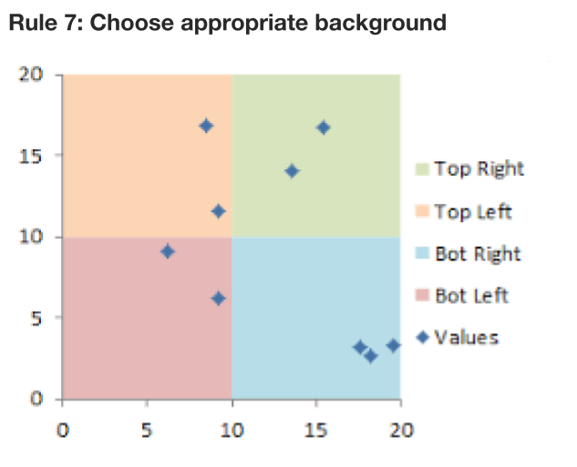
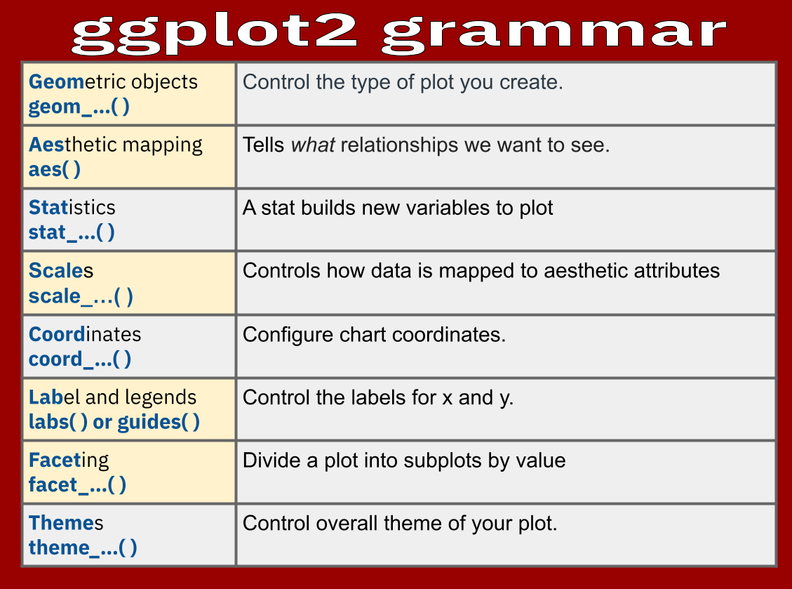

class: clear, title-slide, inverse, center, top, middle

```{r setup, include=FALSE}
knitr::opts_chunk$set(echo = FALSE)
```

```{r, echo=FALSE}
# then load all the relevant packages
pacman::p_load(pacman, knitr, tidyverse, here)

```

```{r xaringan-panelset, echo=FALSE}
xaringanExtra::use_panelset()
```

```{r xaringanExtra-clipboard, echo=FALSE}
# these allow any code snippets to be copied to the clipboard so they 
# can be pasted easily
htmltools::tagList(
  xaringanExtra::use_clipboard(
    button_text = "<i class=\"fa fa-clipboard\"></i>",
    success_text = "<i class=\"fa fa-check\" style=\"color: #90BE6D\"></i>",
  ),
  rmarkdown::html_dependency_font_awesome()
)
```
```{r xaringan-extras, echo=FALSE}
xaringanExtra::use_tile_view()

```

# `r rmarkdown::metadata$title`
----
### `r rmarkdown::metadata$author`
### `r format(Sys.time(), "%B %d, %Y")`

---
# Recap from Learning Analytics Workflow

--

- Learning Analytics workflow

--

- Characteristics of Data (Format)

---
# Agenda

.pull-left[**Part-1  Conceptual Overview**
- Purpose of Visualizations
- Principles
  + Perception
  + Color
  + Cognitive Processing
  ]


.pull-right[**Part-2  Code-Along**
- Explore phase
- `ggplot2` grammar
- Scatter plot
- Histogram
]

.footnote[Pre-Readings
[Data Visualization: A practical Introduction(Ch. 1 & 3) by Kieren Healy](https://socviz.co/)

[R for Data Science, (Ch. 3) by Hadley Wickham & Garrett Grolemund](https://r4ds.had.co.nz/index.html)
]

---

class: clear, inverse, middle, center

Part 1:

----

Intro to Data Visualization: Conceptual Overview

---


# Purpose of Data Visualizations

.panelset[

.panel[.panel-name[Why?]

.center[

]
]


.panel[.panel-name[Who?]
.center[

]
]


.panel[.panel-name[What?]

.center[

]
]


]

???
**WHY TAB**

Looking at data graphed visualization may be easy to understand but it can be messy.
This visualization looks at Twitter sentiment of four popular Learning Management Systems. 

Looking at the the frequency table on the left it is hard to get a good sense of the twitter sentiment for each LMS.

In the the visualization on the right we can quickly see that it looks as though Blackboard had the most positive scores. However, when really diving in and reading the analysis you know that the Twitter counts for Blackboard were the lowest. So, this graph is very informative but requires you to look at all of the analysis for understanding.

In "Data Science for Education," Estrellado et al. (2020) states," that while this relationship might seem intuitive, you can’t draw a definitive conclusion just from the visualization, because it doesn’t tell you whether the relationship between those variables is meaningful." In the proceeding session we will talk about modeling. 

The authors explain that, while descriptive statistics and data visualization during the**Explore** step can help us to identify patterns

and relationships in our data, statistical models can be used to help us determine if relationships, patterns and trends are actually meaningful.

In Learning Analytics goes to school there is a chapter on exploratory Analysis that is linked in optional readings. As a general rule of thumb, Exploratory Data Analysis (EDA) is a set of steps to guide you in the Explore phase. Primarily pairing visualization data and feature engineering to look at, create and understand features value and identify new features where necessary.


**WHO TAB**
Healy, 2018 explains that knowing who you are creating the visualization for is as important as how it looks in an abstract. Taking large sets of data and having an idea of what sort of visual work is most effective to deliberately simplify things in a way that lets us see past a cloud of data points shown in a figure.

Knowing(who the stakeholders are) is just as important as tidying the data. Having an image for an audience of experts reading a professional journal is going to differ from having one to be interpreted by the public.

We will talk more about this in lab 4 when we learn about R amrkdown output  formats.


**WHAT TAB**


---
# Principles

.panelset[

.panel[.panel-name[Graph Construction]


.center[

]
]


.panel[.panel-name[Perception]


]

.panel[.panel-name[Color]


]


.panel[.panel-name[Relationships]

.pull-left[
- **Proximity**
- **Similarity**
- **Connection**
- **Continuity**
- **Closure**
- **Figure and Ground**
- **Common Fate**

]
.pull-right[


]
]

]
???
**GRAPH CONSTRUCTION TAB**

Healy suggests we can often clean up the typeface, remove extraneous colors and backgrounds, and simplify, mute, or delete gridlines, superfluous axis marks, or needless keys and legends.

Following (Tufte, 1983, p. 177)principles of having “more routine, workaday designs,” create charts 
-by having a properly chosen format and design,” 
-“use words, numbers, and drawing together,” 
-“display an accessible complexity of detail” and “avoid content-free decoration, including chartjunk.


Here we are showing a chart from the readings that Healy states is of bad taste 

Not so much on how it looks rather, how human visual perception works.


Another graph shows bad data. The top one is over inflated.

Add what this data was about from Healy


**PERCEPTION TAB**

This is a great graphic from Healy's book. 

What do you see with the graph on the **left**?

- the lines appear at first glance to be converging as the value of x increases. 
- they might even intersect if we extended the graph out further

What about the graph on the **right**?
- the curves are clearly equidistant from the beginning. 

These are the same graph - But misleading. The apparent convergence in the left panel is just a result of the aspect ratio of the figure.


**COLOR TAB**

Write something about the color from Healys


**RELATIONSHIPS TAB**

- **Proximity**: Things that are spatially near to one another seem to be related.
- **Similarity**: Things that look alike seem to be related.
- **Connection**: Things that are visually tied to one another seem to be related.
- **Continuity**: Partially hidden objects are completed into familiar shapes.
- **Closure**: Incomplete shapes are perceived as complete.
- **Figure and Ground**: Visual elements are taken to be either in the foreground or the background.
- **Common Fate**: Elements sharing a direction of movement are perceived as a unit.

---

# More on Color

.panelset[

.panel[.panel-name[Rule 1]


.center[

]


.panel[.panel-name[Rule2]


]

.panel[.panel-name[Rule3]


]

.panel[.panel-name[Rule4]


]
.panel[.panel-name[Rule5]


]
.panel[.panel-name[Rule6]


]
.panel[.panel-name[Rule7]


]
.panel[.panel-name[Rule8]


]
]

]

???

From https://towardsdatascience.com/8-rules-for-optimal-use-of-color-in-data-visualization-b283ae1fc1e2
---


class: clear, inverse, middle, center
Part 2:

----

Code-Along


---
# Explore setup

.panelset[

.panel[.panel-name[EXPLORE PHASE]


]

.panel[.panel-name[TABLE]

```{r echo = TRUE, eval=FALSE}
#load library
library(skimr)

#skim data
skim(data_to_explore)
```

]


.panel[.panel-name[TIDY]
```{r eval=FALSE, echo=TRUE}
data_to_explore %>% 
  select(c('subject', 'gender', 'proportion_earned', 'time_spent')) %>% 
  filter(subject == "OcnA" | subject == "PhysA") %>%
  skim() <##
```

]
]

???
**EXPLORE TAB**


**TABLE TAB**

As highlighted in both
[DSEIUR](https://datascienceineducation.com/c03.html#doing-analysis-exploring-visualizing-and-modeling-data)
and Learning Analytics Goes to School, calculating summary statistics
and data visualization are a key part of exploratory data analysis. One
goal in this phase is explore questions that drive the original analysis
and develop new questions and hypotheses to test in later stages. 
In this part we will:
-   **Summarize Key Stats**. We'll learn about the {skmir} package for
    pulling together some quick creating descriptive statistics when
    your goal is to understand your data internally.

-   **Visualize Data**. We'll introduce the scatter plots for examining potential relationships between time spent and student performance. Then we will look at histogram geom for taking a
    quick peak at the distributions of some key variables.
    
    On the right,
    we see that the skimr package is used for creating descriptive statistics *when your goal
is to understand your data internally* (rather than to create a table for an external-to-the-research-team audience, like for a journal article).

-   Pass to the `skim()` function a single argument
-   That single *argument* is the data frame (aka in tidyverse parlance,
    a tibble) for which you are aiming to calculate descriptive
    statistics
    
**Note:** If you are having difficult viewing your data in the code
chunk, try clicking the icon in the output that looks like a spreadsheet
with an arrow on it to expand your output in a separate window.


**TIDY TAB**


---

# GGplot2 - Scatter plot

.panelset[

.panel[.panel-name[Grammar 101]
.center[

]

]


.panel[.panel-name[Data, AES, Geom]

.pull-left[
```{r echo = TRUE, eval=FALSE}
#layer 1: add data and aesthetics mapping 
ggplot(data_to_explore, #<<
       aes(x = time_spent_hours, 
           y = proportion_earned)) +
#layer 2: +  geom function type
  geom_point() #<<
```
]
.pull-right[


]
]


.panel[.panel-name[Scale]

.pull-left[
```{r echo = TRUE, eval=FALSE}
#layer 1: add data and aesthetics mapping 
#layer 3: add color scale by type
ggplot(data_to_explore, 
       aes(x = time_spent_hours, 
           y = proportion_earned,
           color = enrollment_status)) + #<<
#layer 2: +  geom function type
  geom_point()
```
]
.pull-right[


]
]

.panel[.panel-name[Labels]

.pull-left[
```{r echo = TRUE, eval=FALSE}
#layer 1: add data and aesthetics mapping 
#layer 3: add color scale by type
ggplot(data_to_explore, 
       aes(x = time_spent_hours, 
           y = proportion_earned,
           color = enrollment_status)) +
#layer 2: +  geom function type
  geom_point() +
#layer 4: add labels
  labs(title="How Time Spent on Course LMS is Related to Points Earned in the Course", #<<
       x="Time Spent (Hours)", #<<
       y = "Proportion of Points Earned")  #<<
```
]
.pull-right[


]
]

.panel[.panel-name[Facet]

.pull-left[
```{r echo = TRUE, eval=FALSE}
#layer 1: add data and aesthetics mapping 
#layer 3: add color scale by type
ggplot(data_to_explore, aes(x = time_spent_hours, y = proportion_earned, color = enrollment_status)) +
#layer 2: +  geom function type
  geom_point() +
#layer 4: add labels
    labs(title="How Time Spent on Course LMS is Related to Points Earned in the Course", 
       x="Time Spent (Hours)",
       y = "Proportion of Points Earned")
#layer 5: add facet wrap
  facet_wrap(~ subject) #<<
```
]
.pull-right[


]
]
]

**GRAMMER 101 TAB**

In the last session we looked at the first two parts of the Learning Analytics Workflow, *Prepare* and *Wrangle.*
In this session we will continue with the *Explore* phase in the LA workflow cycle. 
ggplot. An important package that is used for data visualization.

ggplot consists of a grammar of graphics to organize and make sense of  different elements (Wilkinson, 2005). Healy explains that ggplot breaks up the task of making a graph into a series of distinct tasks. 

ggplot had logical connections between your data and the plot elements are called aesthetic mappings

ggplot2 has **layers** what you see on the plot (lines, points, etc)

- The overall type of plot is called a **geom.** Each geom has a function that creates it.
- Of course you must name the data that you are using.

- mappings are specified using the **aes()** function.  we need to tell it which variables in the data should be represented by which visual elements in the plot. It also doesn’t know what sort of plot we want.
- **scales** function maps the data to graphical output
- **coordinates** the visualization perspective (grid)
- **labels and legends** create titles and change up your legends.
- **faceting** provides digital "drill-down" into the data. Multiple plots by value
- **theme** fine grain control over the visualization of the display (fonts)

Do you need all of these things to create a graph? No!


**DATA, AES.. TAB**

What you need to create a graph 80% of the time is 
1. **The data**: the raw material that is required for your visualization what you are trying to explore.
2. **Aesthetics**: Its the mappings of your data to the visualization.
3. **Layer**: must provide graphics layers as geom functions. You will need to tell them what geom function you want to render based on the data you provide and the aesthetic mapping. ie: geom_line(), geom_bar() etc

Recall our engineered data to explore dataset. Here we call the ggplot () functions, we then add our dataset = "data_to_explore" followed by a comma and then the aes() function stating the variables we want to run for x and y. 

While in the ggplot function we will always use a plus operator and not the pipe. The pipe is for dplyr and we are working in ggplot2.

Immediately the next layer is the geom() function. we are going to create a scatter plot so we will use the geom_point() function.
This is the least amount you need to create a graph 80% of the time. 
Do you think this would be enough. No we could add a scale to it.


**SCALE TAB**


**LABELS TAB**


**FACET TAB**

---
# GGplot2 - Histogram
.panelset[

.panel[.panel-name[Grammar 101]
```{r echo=FALSE, warning=FALSE, message=FALSE}
data_to_explore <- read_csv(here("data", "data_to_explore.csv"))
```


.pull-left[

```{r hist1, echo=TRUE, fig.show='hide', message=FALSE, warning=FALSE}

# Layer 1: add data and aesthetic mapping
data_to_explore %>% #<<
  ggplot(aes(x = time_spent_hours)) +
# layer 2: add histogram geom
  geom_histogram()
```
]
.pull-right[

```{r, ref.label="hist1", echo=FALSE, message=FALSE, warning=FALSE,  out.width = '300px'}
# Layer 1: add data and aesthetic mapping
data_to_explore %>% ##<
  ggplot(aes(x = time_spent_hours)) +
# layer 2: add histogram geom
  geom_histogram()
```

]


]

.panel[.panel-name[Bin]
.pull-left[
```{r hist2, echo=TRUE, fig.show='hide', message=FALSE, warning=FALSE}
# Layer 1: add data and aesthetic mapping
data_to_explore %>% 
  ggplot(aes(x = time_spent_hours)) +
# layer 2: add histogram geom 
# layer 3a: add bin size
  geom_histogram(bins = 10)#<<
```
]

.pull-right[
```{r ref.label="hist2", echo=FALSE, message=FALSE, warning=FALSE,  out.width = '300px'}

# Layer 1: add data and aesthetic mapping
data_to_explore %>% 
  ggplot(aes(x = time_spent_hours)) +
# layer 2: add histogram geom 
# layer 3a: add bin size
  geom_histogram(bins = 10)#<<

```
]
]

.panel[.panel-name[Color]
.pull-left[
```{r hist3, echo=TRUE, fig.show='hide', message=FALSE, warning=FALSE}
# Layer 1: add data and aesthetic mapping
data_to_explore %>% 
  ggplot(aes(x = time_spent_hours)) +
# layer 2: add histogram geom 
# layer 3a: add bin size
#layer 3b: add color
  geom_histogram(bins = 30,
                 fill = "red", #<<
                 colour = "black") #<<
```
]

.pull-right[
```{r ref.label="hist3", echo=FALSE, message=FALSE, warning=FALSE,  out.width = '300px'}
# Layer 1: add data and aesthetic mapping
data_to_explore %>% 
  ggplot(aes(x = time_spent_hours)) +
# layer 2: add histogram geom 
# layer 3a: add bin size
#layer 3b: add color
  geom_histogram(bins = 30, 
                 fill = "red", 
                 colour = "black")
```
]
]

.panel[.panel-name[Labels]

.pull-left[
```{r hist4, echo=TRUE, fig.show='hide', message=FALSE, warning=FALSE}
# Layer 1: add data and aesthetic mapping
data_to_explore %>% 
  ggplot(aes(x = time_spent_hours)) +
# layer 2: add histogram geom 
# layer 3a: add bin size
# layer 3b: add color
  geom_histogram(bins = 30, fill = "red", colour = "black")+
#layer 4: add Labels
  labs(title="Time Spent on LMS histogram plot",x="Time Spent(hours)", y = "Count")+
  theme_classic()
```
]

.pull-right[
```{r ref.label="hist4", echo=FALSE, message=FALSE, warning=FALSE,  out.width = '300px'}
# Layer 1: add data and aesthetic mapping
data_to_explore %>% 
  ggplot(aes(x = time_spent_hours)) +
# layer 2: add histogram geom 
# layer 3a: add bin size
# layer 3b: add color
  geom_histogram(bins = 30, fill = "red", colour = "black")+
# layer 4: add labels
  labs(title="Time Spent on LMS histogram plot",x="Weight(kg)", y = "Count")+
#layer 5: add theme
  theme_classic()

```
]

]
]


---

class: inverse, clear, center

## .font130[.pull-left[**What's next?**]]

<br/><br/><br/><br/><br/>

.pull-left-wide[.left[.font100[
-  Make sure to complete the R Programming primer: [Introduction to data visualization](https://rstudio.cloud/learn/primers/3).

-  Complete the badge requirement document: [foudationlab3_badge- Data Visualization](https://github.com/laser-institute/foundational-skills/blob/master/foundation_lab_3/foundationlab3_badge.Rmd).
]]
]

## .font175[.center[Thank you! Any questions?]]


---

