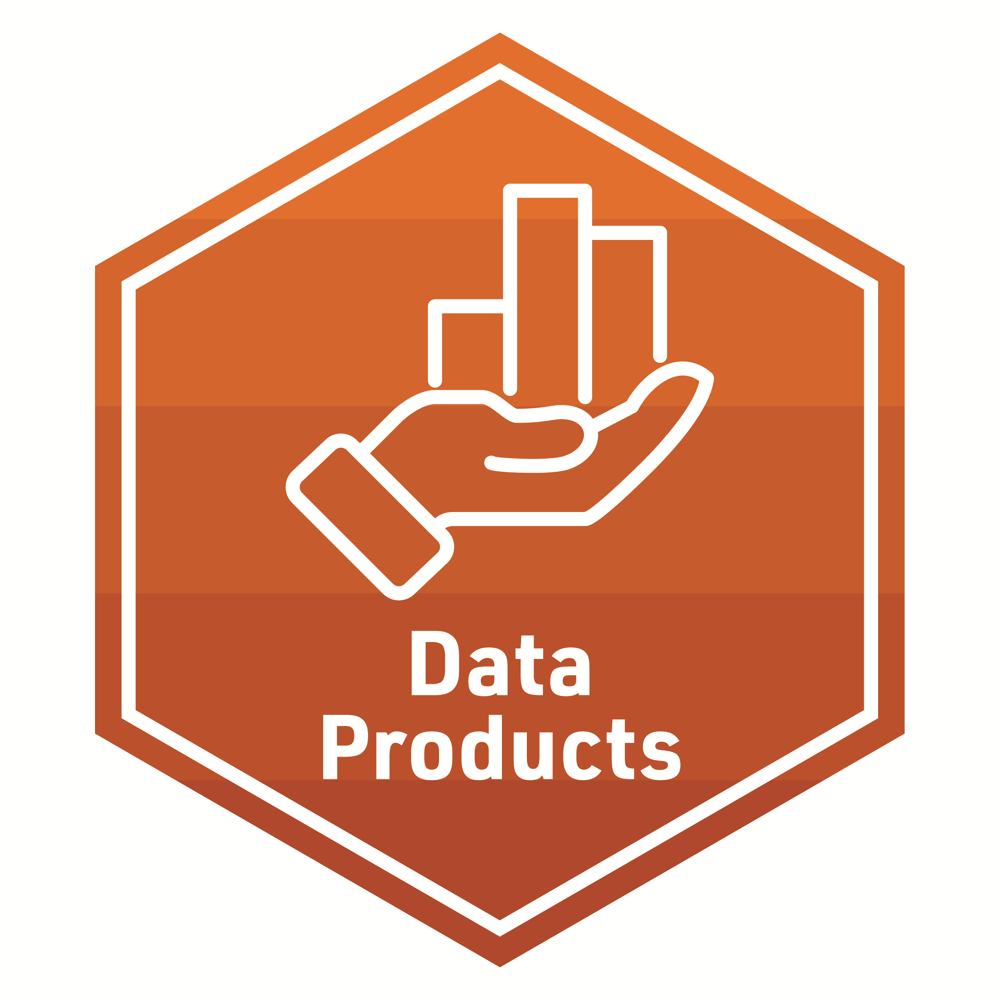

## **Foundation-lab 4** - Data Products

**Required Pre-Reading:**

1. [Learning Analytics Goes to School, (Model/Communicate Ch. 3, pp. 49 - 59) By Andrew Krumm, Barbara Means, Marie Bienkowski](https://laser-institute.github.io/LASER_Foundations_2023/lab4/Readings/Learning%20Analytics%20Goes%20to%20School.pdf)
2. [R for Data Science, (Ch. 28 & 29) by Hadley Wickham & Garrett Grolemund](https://r4ds.had.co.nz/graphics-for-communication.html)
3. [OPTIONAL: Communicating data to an audience. By Drucker, Huron, Kosara, Schwabish & Diakopoulos](https://laser-institute.github.io/LASER_Foundations_2023/lab4/Readings/Communicating%20Data%20to%20an%20Audience%20-%20preprint%20copy.pdf)

**[Foundation Presentation - Four](https://laser-institute.github.io/LASER_Foundations_2023/lab4/found-lab-4-slides.html#1) and code-along:**

This presentation will cover the essentials of crafting a data product for different stakeholders. 

- Data storytelling
- narrative elements, 
- methods for improving stakeholder understanding and facilitating resolution or call-to-action. 

The code-along will focus on using R Markdown to create reports in a variety of formats and will introduce formatting for bibliographies and in-text citations for scholarly publications.

Case Study work includes:
- Model
  + Correlation Matrix
    + APA Formatted Table
  + Linear Regression
    + APA Formatted Table
  + Summarize 

- Communicate
  + Select
  + Polish
  + Narrate
  

**Required Work:**

-  Make sure to complete the R Programming primer: [R Markdown](https://rmarkdown.rstudio.com/lesson-1.html?_ga=2.149737333.2122961316.1655817816-1599820931.1654624890)

**Badge Requirement**

-  Complete the badge requirement document from your lab 4 folder [foudationlab4_badge - Data Products](https://laser-institute.github.io/foundational-skills/foundation_lab_4/foundationlab4_badge.html).

